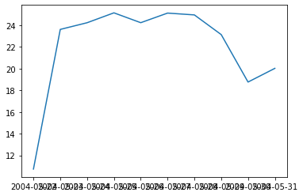
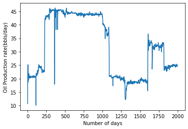
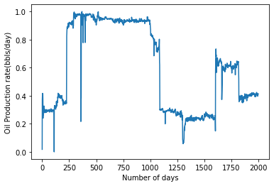
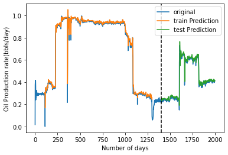
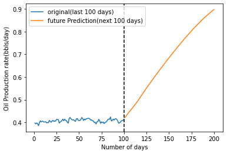
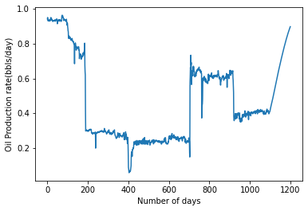

# Time series forecasting of petroleum production using DLSTM


```python
import pandas as pd
import numpy as np
import matplotlib.pyplot as plt
```

## Data preprocessing


```python
df=pd.read_csv("C:/Users/91725/Downloads/oil.csv")
```


```python
df
```


<div>
<style scoped>
    .dataframe tbody tr th:only-of-type {
        vertical-align: middle;
    }

    .dataframe tbody tr th {
        vertical-align: top;
    }

    .dataframe thead th {
        text-align: right;
    }
</style>
<table border="1" class="dataframe">
  <thead>
    <tr style="text-align: right;">
      <th></th>
      <th>Time</th>
      <th>Production</th>
    </tr>
  </thead>
  <tbody>
    <tr>
      <th>0</th>
      <td>5/22/2004</td>
      <td>10.7415</td>
    </tr>
    <tr>
      <th>1</th>
      <td>5/23/2004</td>
      <td>23.6240</td>
    </tr>
    <tr>
      <th>2</th>
      <td>5/24/2004</td>
      <td>24.2405</td>
    </tr>
    <tr>
      <th>3</th>
      <td>5/25/2004</td>
      <td>25.1527</td>
    </tr>
    <tr>
      <th>4</th>
      <td>5/26/2004</td>
      <td>24.2440</td>
    </tr>
    <tr>
      <th>...</th>
      <td>...</td>
      <td>...</td>
    </tr>
    <tr>
      <th>5332</th>
      <td>12/27/2018</td>
      <td>10.7386</td>
    </tr>
    <tr>
      <th>5333</th>
      <td>12/28/2018</td>
      <td>10.7306</td>
    </tr>
    <tr>
      <th>5334</th>
      <td>12/29/2018</td>
      <td>11.1873</td>
    </tr>
    <tr>
      <th>5335</th>
      <td>12/30/2018</td>
      <td>10.7262</td>
    </tr>
    <tr>
      <th>5336</th>
      <td>12/31/2018</td>
      <td>10.7001</td>
    </tr>
  </tbody>
</table>
<p>5337 rows × 2 columns</p>
</div>


## Data visualization


```python
plt.figure(figsize=(20,61)) 
```


    <Figure size 1440x4392 with 0 Axes>


    <Figure size 1440x4392 with 0 Axes>


```python
plt.plot(df['Time'].iloc[:10],df['Production'].iloc[:10])
plt.figure(figsize=(200,61)) 
plt.show()
```


    

    


    <Figure size 14400x4392 with 0 Axes>


```python
df1=df.reset_index()['Production'].iloc[:2000]
```


```python
df1
```


    0       10.7415
    1       23.6240
    2       24.2405
    3       25.1527
    4       24.2440
             ...   
    1995    24.5978
    1996    24.7815
    1997    24.8260
    1998    24.8738
    1999    25.0443
    Name: Production, Length: 2000, dtype: float64


```python
import matplotlib.pyplot as plt
plt.plot(df1)
plt.xlabel('Number of days')
plt.ylabel('Oil Production rate(bbls/day)')
```


    Text(0, 0.5, 'Oil Production rate(bbls/day)')


    

    


```python
df1
```


    0       10.7415
    1       23.6240
    2       24.2405
    3       25.1527
    4       24.2440
             ...   
    1995    24.5978
    1996    24.7815
    1997    24.8260
    1998    24.8738
    1999    25.0443
    Name: Production, Length: 2000, dtype: float64


## Data preprocessing using MinMaxScaler


```python
from sklearn.preprocessing import MinMaxScaler
scaler=MinMaxScaler(feature_range=(0,1))
df1=scaler.fit_transform(np.array(df1).reshape(-1,1))
```


```python
df6 = scaler.inverse_transform(scaler.fit_transform(np.array(df1).reshape(-1,1)))
```


```python
import matplotlib.pyplot as plt
plt.plot(df1)
plt.xlabel('Number of days')
plt.ylabel('Oil Production rate(bbls/day)')
```


    Text(0, 0.5, 'Oil Production rate(bbls/day)')


    

    


##  Data splitting


```python
training_size=int(len(df1)*0.65)
test_size=len(df1)-training_size
train_data,test_data=df1[0:training_size,:],df1[training_size:len(df1),:1]
```


```python
training_size,test_size
```


    (1300, 700)


```python
train_data
```


    array([[0.01774319],
           [0.37455961],
           [0.39163528],
           ...,
           [0.2611899 ],
           [0.22535176],
           [0.17317472]])


```python
import numpy
# convert an array of values into a dataset matrix
def create_dataset(dataset, time_step=1):
	dataX, dataY = [], []
	for i in range(len(dataset)-time_step-1):
		a = dataset[i:(i+time_step), 0]   ###i=0, 0,1,2,3-----99   100 
		dataX.append(a)
		dataY.append(dataset[i + time_step, 0])
	return numpy.array(dataX), numpy.array(dataY)
```


```python
time_step = 100
X_train, y_train = create_dataset(train_data, time_step)
X_test, ytest = create_dataset(test_data, time_step)
```


```python
print(X_train.shape), print(y_train.shape)
```

    (1199, 100)
    (1199,)
    


    (None, None)


```python
X_test
```


    array([[0.08859683, 0.082038  , 0.06818635, ..., 0.23579936, 0.24056337,
            0.23947485],
           [0.082038  , 0.06818635, 0.05843397, ..., 0.24056337, 0.23947485,
            0.23384113],
           [0.06818635, 0.05843397, 0.07111677, ..., 0.23947485, 0.23384113,
            0.23469422],
           ...,
           [0.38877964, 0.40586916, 0.40082539, ..., 0.39680922, 0.39739918,
            0.40153169],
           [0.40586916, 0.40082539, 0.40171172, ..., 0.39739918, 0.40153169,
            0.40661977],
           [0.40082539, 0.40171172, 0.39677321, ..., 0.40153169, 0.40661977,
            0.40785232]])


```python
print(X_test.shape), print(ytest.shape)
```

    (599, 100)
    (599,)
    


    (None, None)


```python
X_train =X_train.reshape(X_train.shape[0],X_train.shape[1] , 1)
X_test = X_test.reshape(X_test.shape[0],X_test.shape[1] , 1)
```


```python
X_test
```


    array([[[0.08859683],
            [0.082038  ],
            [0.06818635],
            ...,
            [0.23579936],
            [0.24056337],
            [0.23947485]],
    
           [[0.082038  ],
            [0.06818635],
            [0.05843397],
            ...,
            [0.24056337],
            [0.23947485],
            [0.23384113]],
    
           [[0.06818635],
            [0.05843397],
            [0.07111677],
            ...,
            [0.23947485],
            [0.23384113],
            [0.23469422]],
    
           ...,
    
           [[0.38877964],
            [0.40586916],
            [0.40082539],
            ...,
            [0.39680922],
            [0.39739918],
            [0.40153169]],
    
           [[0.40586916],
            [0.40082539],
            [0.40171172],
            ...,
            [0.39739918],
            [0.40153169],
            [0.40661977]],
    
           [[0.40082539],
            [0.40171172],
            [0.39677321],
            ...,
            [0.40153169],
            [0.40661977],
            [0.40785232]]])


## Model Development


```python
from tensorflow.keras.models import Sequential
from tensorflow.keras.layers import Dense
from tensorflow.keras.layers import LSTM
```


```python
model=Sequential()
model.add(LSTM(50,return_sequences=True,input_shape=(100,1)))
model.add(LSTM(50,return_sequences=True))
model.add(LSTM(50))
model.add(Dense(1))
model.compile(loss='mean_squared_error',optimizer='adam')
```


```python
model.summary()
```

    Model: "sequential"
    _________________________________________________________________
     Layer (type)                Output Shape              Param #   
    =================================================================
     lstm (LSTM)                 (None, 100, 50)           10400     
                                                                     
     lstm_1 (LSTM)               (None, 100, 50)           20200     
                                                                     
     lstm_2 (LSTM)               (None, 50)                20200     
                                                                     
     dense (Dense)               (None, 1)                 51        
                                                                     
    =================================================================
    Total params: 50,851
    Trainable params: 50,851
    Non-trainable params: 0
    _________________________________________________________________
    


```python
model.summary()
```

    Model: "sequential"
    _________________________________________________________________
     Layer (type)                Output Shape              Param #   
    =================================================================
     lstm (LSTM)                 (None, 100, 50)           10400     
                                                                     
     lstm_1 (LSTM)               (None, 100, 50)           20200     
                                                                     
     lstm_2 (LSTM)               (None, 50)                20200     
                                                                     
     dense (Dense)               (None, 1)                 51        
                                                                     
    =================================================================
    Total params: 50,851
    Trainable params: 50,851
    Non-trainable params: 0
    _________________________________________________________________
    


```python
model.fit(X_train,y_train,validation_data=(X_test,ytest),epochs=100,batch_size=64,verbose=1)
```

    Epoch 1/100
    19/19 [==============================] - 11s 222ms/step - loss: 0.1359 - val_loss: 0.0053
    Epoch 2/100
    19/19 [==============================] - 2s 132ms/step - loss: 0.0131 - val_loss: 0.0066
    Epoch 3/100
    19/19 [==============================] - 2s 132ms/step - loss: 0.0074 - val_loss: 0.0057
    Epoch 4/100
    19/19 [==============================] - 3s 140ms/step - loss: 0.0055 - val_loss: 0.0038
    Epoch 5/100
    19/19 [==============================] - 3s 140ms/step - loss: 0.0052 - val_loss: 0.0039
    Epoch 6/100
    19/19 [==============================] - 3s 140ms/step - loss: 0.0051 - val_loss: 0.0036
    Epoch 7/100
    19/19 [==============================] - 3s 152ms/step - loss: 0.0050 - val_loss: 0.0037
    Epoch 8/100
    19/19 [==============================] - 2s 131ms/step - loss: 0.0050 - val_loss: 0.0036
    Epoch 9/100
    19/19 [==============================] - 2s 128ms/step - loss: 0.0050 - val_loss: 0.0037
    Epoch 10/100
    19/19 [==============================] - 2s 131ms/step - loss: 0.0050 - val_loss: 0.0043
    Epoch 11/100
    19/19 [==============================] - 2s 132ms/step - loss: 0.0050 - val_loss: 0.0034
    Epoch 12/100
    19/19 [==============================] - 3s 136ms/step - loss: 0.0048 - val_loss: 0.0033
    Epoch 13/100
    19/19 [==============================] - 3s 136ms/step - loss: 0.0047 - val_loss: 0.0032
    Epoch 14/100
    19/19 [==============================] - 3s 134ms/step - loss: 0.0047 - val_loss: 0.0034
    Epoch 15/100
    19/19 [==============================] - 2s 128ms/step - loss: 0.0046 - val_loss: 0.0032
    Epoch 16/100
    19/19 [==============================] - 2s 127ms/step - loss: 0.0044 - val_loss: 0.0030
    Epoch 17/100
    19/19 [==============================] - 2s 131ms/step - loss: 0.0045 - val_loss: 0.0030
    Epoch 18/100
    19/19 [==============================] - 3s 137ms/step - loss: 0.0044 - val_loss: 0.0030
    Epoch 19/100
    19/19 [==============================] - 3s 134ms/step - loss: 0.0045 - val_loss: 0.0030
    Epoch 20/100
    19/19 [==============================] - 3s 134ms/step - loss: 0.0047 - val_loss: 0.0039
    Epoch 21/100
    19/19 [==============================] - 2s 129ms/step - loss: 0.0044 - val_loss: 0.0029
    Epoch 22/100
    19/19 [==============================] - 2s 127ms/step - loss: 0.0042 - val_loss: 0.0032
    Epoch 23/100
    19/19 [==============================] - 3s 134ms/step - loss: 0.0042 - val_loss: 0.0028
    Epoch 24/100
    19/19 [==============================] - 2s 129ms/step - loss: 0.0042 - val_loss: 0.0028
    Epoch 25/100
    19/19 [==============================] - 2s 128ms/step - loss: 0.0042 - val_loss: 0.0028
    Epoch 26/100
    19/19 [==============================] - 3s 133ms/step - loss: 0.0042 - val_loss: 0.0028
    Epoch 27/100
    19/19 [==============================] - 2s 130ms/step - loss: 0.0040 - val_loss: 0.0027
    Epoch 28/100
    19/19 [==============================] - 2s 127ms/step - loss: 0.0040 - val_loss: 0.0027
    Epoch 29/100
    19/19 [==============================] - 2s 130ms/step - loss: 0.0041 - val_loss: 0.0029
    Epoch 30/100
    19/19 [==============================] - 2s 130ms/step - loss: 0.0040 - val_loss: 0.0026
    Epoch 31/100
    19/19 [==============================] - 2s 129ms/step - loss: 0.0038 - val_loss: 0.0026
    Epoch 32/100
    19/19 [==============================] - 3s 136ms/step - loss: 0.0039 - val_loss: 0.0026
    Epoch 33/100
    19/19 [==============================] - 3s 135ms/step - loss: 0.0039 - val_loss: 0.0025
    Epoch 34/100
    19/19 [==============================] - 2s 132ms/step - loss: 0.0039 - val_loss: 0.0025
    Epoch 35/100
    19/19 [==============================] - 3s 135ms/step - loss: 0.0038 - val_loss: 0.0026
    Epoch 36/100
    19/19 [==============================] - 2s 131ms/step - loss: 0.0037 - val_loss: 0.0024
    Epoch 37/100
    19/19 [==============================] - 3s 134ms/step - loss: 0.0037 - val_loss: 0.0024
    Epoch 38/100
    19/19 [==============================] - 3s 138ms/step - loss: 0.0036 - val_loss: 0.0023
    Epoch 39/100
    19/19 [==============================] - 3s 136ms/step - loss: 0.0037 - val_loss: 0.0024
    Epoch 40/100
    19/19 [==============================] - 2s 131ms/step - loss: 0.0035 - val_loss: 0.0023
    Epoch 41/100
    19/19 [==============================] - 2s 127ms/step - loss: 0.0036 - val_loss: 0.0026
    Epoch 42/100
    19/19 [==============================] - 2s 133ms/step - loss: 0.0035 - val_loss: 0.0021
    Epoch 43/100
    19/19 [==============================] - 2s 127ms/step - loss: 0.0034 - val_loss: 0.0021
    Epoch 44/100
    19/19 [==============================] - 2s 128ms/step - loss: 0.0033 - val_loss: 0.0021
    Epoch 45/100
    19/19 [==============================] - 3s 144ms/step - loss: 0.0032 - val_loss: 0.0022
    Epoch 46/100
    19/19 [==============================] - 3s 152ms/step - loss: 0.0032 - val_loss: 0.0020
    Epoch 47/100
    19/19 [==============================] - 3s 160ms/step - loss: 0.0031 - val_loss: 0.0022
    Epoch 48/100
    19/19 [==============================] - 3s 166ms/step - loss: 0.0030 - val_loss: 0.0019
    Epoch 49/100
    19/19 [==============================] - 3s 166ms/step - loss: 0.0029 - val_loss: 0.0018
    Epoch 50/100
    19/19 [==============================] - 3s 151ms/step - loss: 0.0027 - val_loss: 0.0020
    Epoch 51/100
    19/19 [==============================] - 3s 161ms/step - loss: 0.0031 - val_loss: 0.0017
    Epoch 52/100
    19/19 [==============================] - 3s 153ms/step - loss: 0.0032 - val_loss: 0.0018
    Epoch 53/100
    19/19 [==============================] - 3s 140ms/step - loss: 0.0029 - val_loss: 0.0017
    Epoch 54/100
    19/19 [==============================] - 3s 152ms/step - loss: 0.0027 - val_loss: 0.0016
    Epoch 55/100
    19/19 [==============================] - 3s 150ms/step - loss: 0.0025 - val_loss: 0.0016
    Epoch 56/100
    19/19 [==============================] - 3s 144ms/step - loss: 0.0024 - val_loss: 0.0015
    Epoch 57/100
    19/19 [==============================] - 3s 145ms/step - loss: 0.0026 - val_loss: 0.0019
    Epoch 58/100
    19/19 [==============================] - 3s 134ms/step - loss: 0.0025 - val_loss: 0.0018
    Epoch 59/100
    19/19 [==============================] - 3s 136ms/step - loss: 0.0023 - val_loss: 0.0015
    Epoch 60/100
    19/19 [==============================] - 3s 136ms/step - loss: 0.0024 - val_loss: 0.0014
    Epoch 61/100
    19/19 [==============================] - 2s 131ms/step - loss: 0.0025 - val_loss: 0.0014
    Epoch 62/100
    19/19 [==============================] - 3s 133ms/step - loss: 0.0022 - val_loss: 0.0013
    Epoch 63/100
    19/19 [==============================] - 3s 135ms/step - loss: 0.0021 - val_loss: 0.0013
    Epoch 64/100
    19/19 [==============================] - 2s 131ms/step - loss: 0.0020 - val_loss: 0.0013
    Epoch 65/100
    19/19 [==============================] - 2s 129ms/step - loss: 0.0021 - val_loss: 0.0013
    Epoch 66/100
    19/19 [==============================] - 2s 128ms/step - loss: 0.0019 - val_loss: 0.0012
    Epoch 67/100
    19/19 [==============================] - 2s 130ms/step - loss: 0.0019 - val_loss: 0.0016
    Epoch 68/100
    19/19 [==============================] - 2s 131ms/step - loss: 0.0020 - val_loss: 0.0013
    Epoch 69/100
    19/19 [==============================] - 3s 138ms/step - loss: 0.0019 - val_loss: 0.0012
    Epoch 70/100
    19/19 [==============================] - 3s 139ms/step - loss: 0.0019 - val_loss: 0.0012
    Epoch 71/100
    19/19 [==============================] - 3s 138ms/step - loss: 0.0019 - val_loss: 0.0012
    Epoch 72/100
    19/19 [==============================] - 2s 132ms/step - loss: 0.0018 - val_loss: 0.0011
    Epoch 73/100
    19/19 [==============================] - 3s 133ms/step - loss: 0.0017 - val_loss: 0.0011
    Epoch 74/100
    19/19 [==============================] - 2s 130ms/step - loss: 0.0016 - val_loss: 0.0011
    Epoch 75/100
    19/19 [==============================] - 3s 135ms/step - loss: 0.0020 - val_loss: 0.0011
    Epoch 76/100
    19/19 [==============================] - 3s 133ms/step - loss: 0.0019 - val_loss: 0.0012
    Epoch 77/100
    19/19 [==============================] - 3s 133ms/step - loss: 0.0017 - val_loss: 0.0010
    Epoch 78/100
    19/19 [==============================] - 2s 131ms/step - loss: 0.0016 - val_loss: 0.0010
    Epoch 79/100
    19/19 [==============================] - 2s 129ms/step - loss: 0.0016 - val_loss: 0.0010
    Epoch 80/100
    19/19 [==============================] - 3s 135ms/step - loss: 0.0018 - val_loss: 0.0010
    Epoch 81/100
    19/19 [==============================] - 3s 159ms/step - loss: 0.0015 - val_loss: 0.0010
    Epoch 82/100
    19/19 [==============================] - 3s 139ms/step - loss: 0.0015 - val_loss: 9.6775e-04
    Epoch 83/100
    19/19 [==============================] - 3s 156ms/step - loss: 0.0015 - val_loss: 9.4361e-04
    Epoch 84/100
    19/19 [==============================] - 3s 139ms/step - loss: 0.0015 - val_loss: 0.0010
    Epoch 85/100
    19/19 [==============================] - 3s 135ms/step - loss: 0.0016 - val_loss: 0.0010
    Epoch 86/100
    19/19 [==============================] - 3s 139ms/step - loss: 0.0015 - val_loss: 9.3519e-04
    Epoch 87/100
    19/19 [==============================] - 3s 142ms/step - loss: 0.0014 - val_loss: 9.4386e-04
    Epoch 88/100
    19/19 [==============================] - 3s 143ms/step - loss: 0.0015 - val_loss: 9.1048e-04
    Epoch 89/100
    19/19 [==============================] - 3s 137ms/step - loss: 0.0014 - val_loss: 8.7985e-04
    Epoch 90/100
    19/19 [==============================] - 3s 136ms/step - loss: 0.0014 - val_loss: 0.0010
    Epoch 91/100
    19/19 [==============================] - 3s 152ms/step - loss: 0.0014 - val_loss: 9.6128e-04
    Epoch 92/100
    19/19 [==============================] - 3s 164ms/step - loss: 0.0014 - val_loss: 8.8407e-04
    Epoch 93/100
    19/19 [==============================] - 3s 146ms/step - loss: 0.0014 - val_loss: 0.0011
    Epoch 94/100
    19/19 [==============================] - 3s 144ms/step - loss: 0.0014 - val_loss: 8.6144e-04
    Epoch 95/100
    19/19 [==============================] - 3s 143ms/step - loss: 0.0014 - val_loss: 8.4814e-04
    Epoch 96/100
    19/19 [==============================] - 3s 146ms/step - loss: 0.0014 - val_loss: 8.4625e-04
    Epoch 97/100
    19/19 [==============================] - 3s 138ms/step - loss: 0.0014 - val_loss: 8.9182e-04
    Epoch 98/100
    19/19 [==============================] - 3s 137ms/step - loss: 0.0014 - val_loss: 8.6505e-04
    Epoch 99/100
    19/19 [==============================] - 3s 145ms/step - loss: 0.0013 - val_loss: 8.4337e-04
    Epoch 100/100
    19/19 [==============================] - 3s 139ms/step - loss: 0.0014 - val_loss: 9.0002e-04
    


    <keras.callbacks.History at 0x2541f9298b0>


## Model Evaluation


```python
import tensorflow as tf
```


```python
tf.__version__
```


    '2.10.0'


```python
train_predict=model.predict(X_train)
test_predict=model.predict(X_test)
```

    38/38 [==============================] - 2s 26ms/step
    19/19 [==============================] - 1s 27ms/step
    


```python
train_predict.shape
```


    (1199, 1)


```python
train_predict=scaler.inverse_transform(train_predict)
test_predict=scaler.inverse_transform(test_predict)
```


```python
test_predict
```


    array([[0.248005  ],
           [0.24794061],
           [0.24689892],
           [0.24688014],
           [0.24927306],
           [0.25312084],
           [0.249141  ],
           [0.23944202],
           [0.23201056],
           [0.23347275],
           [0.2365272 ],
           [0.23877734],
           [0.24088532],
           [0.24201335],
           [0.2434327 ],
           [0.24564338],
           [0.2490588 ],
           [0.25268206],
           [0.25282055],
           [0.25039583],
           [0.25038245],
           [0.25297052],
           [0.25233093],
           [0.2505009 ],
           [0.24635623],
           [0.24043454],
           [0.24525519],
           [0.24870065],
           [0.24893951],
           [0.24687143],
           [0.24827062],
           [0.24977279],
           [0.24862118],
           [0.24874954],
           [0.25101936],
           [0.25239456],
           [0.25380203],
           [0.25538468],
           [0.25454068],
           [0.25347316],
           [0.25234815],
           [0.25281382],
           [0.25270543],
           [0.2514653 ],
           [0.25007093],
           [0.24985102],
           [0.249111  ],
           [0.24853742],
           [0.2476003 ],
           [0.24620923],
           [0.24821334],
           [0.2484056 ],
           [0.24995843],
           [0.2493577 ],
           [0.24646747],
           [0.24643932],
           [0.24565285],
           [0.24625592],
           [0.24816836],
           [0.24793161],
           [0.2477552 ],
           [0.24594826],
           [0.24209866],
           [0.2377396 ],
           [0.2343185 ],
           [0.23283702],
           [0.23865977],
           [0.24580346],
           [0.24979395],
           [0.2507097 ],
           [0.24846108],
           [0.24487641],
           [0.24343419],
           [0.24509615],
           [0.2459392 ],
           [0.24648213],
           [0.24634628],
           [0.252093  ],
           [0.25245425],
           [0.254375  ],
           [0.26110977],
           [0.2664388 ],
           [0.26831523],
           [0.26927766],
           [0.2704428 ],
           [0.26438168],
           [0.25206584],
           [0.24206054],
           [0.23873141],
           [0.23633997],
           [0.23567848],
           [0.23552841],
           [0.2356946 ],
           [0.23594913],
           [0.23534997],
           [0.23459646],
           [0.23454016],
           [0.2369021 ],
           [0.24169698],
           [0.24445479],
           [0.25382596],
           [0.267055  ],
           [0.27138236],
           [0.27089924],
           [0.272193  ],
           [0.27687243],
           [0.27722892],
           [0.27259192],
           [0.2716258 ],
           [0.2708586 ],
           [0.27174017],
           [0.26755244],
           [0.26641494],
           [0.2734238 ],
           [0.27327427],
           [0.27533367],
           [0.28459314],
           [0.28531405],
           [0.28204635],
           [0.2802746 ],
           [0.27917108],
           [0.27537197],
           [0.27489844],
           [0.27771848],
           [0.27839282],
           [0.2820743 ],
           [0.27778265],
           [0.27432975],
           [0.2723554 ],
           [0.27392575],
           [0.27476665],
           [0.27300838],
           [0.27220833],
           [0.2734572 ],
           [0.271008  ],
           [0.26590928],
           [0.26251963],
           [0.25929275],
           [0.2613722 ],
           [0.26646426],
           [0.26731643],
           [0.2652209 ],
           [0.26271892],
           [0.26152894],
           [0.26657438],
           [0.26996258],
           [0.27156836],
           [0.26465195],
           [0.2588435 ],
           [0.25436804],
           [0.25731722],
           [0.25479972],
           [0.2544051 ],
           [0.25792065],
           [0.2620884 ],
           [0.26545194],
           [0.2673523 ],
           [0.26679006],
           [0.2653288 ],
           [0.26528546],
           [0.2665485 ],
           [0.26714653],
           [0.2683397 ],
           [0.27113214],
           [0.26991794],
           [0.26832888],
           [0.26719555],
           [0.26043653],
           [0.26090848],
           [0.26473263],
           [0.26947188],
           [0.27027333],
           [0.27182004],
           [0.27451923],
           [0.27309608],
           [0.27241668],
           [0.27417445],
           [0.274469  ],
           [0.2718646 ],
           [0.27044243],
           [0.25968868],
           [0.25350094],
           [0.253383  ],
           [0.2571637 ],
           [0.25817776],
           [0.25089988],
           [0.24267396],
           [0.23803681],
           [0.23794761],
           [0.24100013],
           [0.24410151],
           [0.24637207],
           [0.24933952],
           [0.24934518],
           [0.24721439],
           [0.24718794],
           [0.24534222],
           [0.24429648],
           [0.24932317],
           [0.25864354],
           [0.2608315 ],
           [0.2596062 ],
           [0.25489402],
           [0.22533736],
           [0.18996228],
           [0.3246129 ],
           [0.52084166],
           [0.6852655 ],
           [0.74240315],
           [0.7673113 ],
           [0.7294546 ],
           [0.691658  ],
           [0.5952516 ],
           [0.54797804],
           [0.60225916],
           [0.6522577 ],
           [0.66261524],
           [0.6576856 ],
           [0.65413827],
           [0.64227664],
           [0.6689682 ],
           [0.6755069 ],
           [0.6834093 ],
           [0.6813745 ],
           [0.6758686 ],
           [0.65683424],
           [0.6495967 ],
           [0.64777315],
           [0.6479238 ],
           [0.6320765 ],
           [0.63360804],
           [0.6334164 ],
           [0.63849014],
           [0.64309734],
           [0.6332683 ],
           [0.6316182 ],
           [0.6439722 ],
           [0.6451186 ],
           [0.65326124],
           [0.65432745],
           [0.65187734],
           [0.6493175 ],
           [0.6524248 ],
           [0.65934694],
           [0.65973544],
           [0.6595965 ],
           [0.6588082 ],
           [0.6569564 ],
           [0.66438574],
           [0.67028564],
           [0.6737518 ],
           [0.66090184],
           [0.6544172 ],
           [0.65575534],
           [0.65601784],
           [0.6605417 ],
           [0.6537462 ],
           [0.6491978 ],
           [0.64540917],
           [0.65178996],
           [0.65402365],
           [0.64563423],
           [0.63989705],
           [0.46173862],
           [0.4069189 ],
           [0.45101434],
           [0.48686793],
           [0.5137044 ],
           [0.58072037],
           [0.6230594 ],
           [0.615697  ],
           [0.59391433],
           [0.59016293],
           [0.5900464 ],
           [0.59509724],
           [0.6036128 ],
           [0.5974093 ],
           [0.60208696],
           [0.59784734],
           [0.5973034 ],
           [0.6046905 ],
           [0.59595317],
           [0.60043097],
           [0.59639513],
           [0.60405475],
           [0.6031374 ],
           [0.5983036 ],
           [0.59078395],
           [0.5917491 ],
           [0.58686805],
           [0.5848427 ],
           [0.586199  ],
           [0.58628637],
           [0.58345586],
           [0.5944504 ],
           [0.61683184],
           [0.6319119 ],
           [0.6216968 ],
           [0.5987598 ],
           [0.59416544],
           [0.60268426],
           [0.6202984 ],
           [0.6212673 ],
           [0.6195073 ],
           [0.6225374 ],
           [0.6261969 ],
           [0.6267189 ],
           [0.6243114 ],
           [0.62257224],
           [0.62317723],
           [0.6205105 ],
           [0.62292683],
           [0.63672173],
           [0.6265482 ],
           [0.61937314],
           [0.61419594],
           [0.6156494 ],
           [0.6158244 ],
           [0.6165911 ],
           [0.62315303],
           [0.61607283],
           [0.6119331 ],
           [0.62170726],
           [0.6269041 ],
           [0.6220642 ],
           [0.6245633 ],
           [0.6253933 ],
           [0.6200177 ],
           [0.62073696],
           [0.62186575],
           [0.6235664 ],
           [0.6271165 ],
           [0.6281423 ],
           [0.62281746],
           [0.6242183 ],
           [0.62424237],
           [0.62367815],
           [0.62527597],
           [0.62877345],
           [0.6215568 ],
           [0.6242044 ],
           [0.62692773],
           [0.6308363 ],
           [0.6364345 ],
           [0.64910704],
           [0.64784867],
           [0.63598853],
           [0.62580025],
           [0.6158633 ],
           [0.61548215],
           [0.6114044 ],
           [0.6169448 ],
           [0.6170241 ],
           [0.6193768 ],
           [0.6104997 ],
           [0.5966967 ],
           [0.5788027 ],
           [0.58527386],
           [0.5939326 ],
           [0.6010369 ],
           [0.6076654 ],
           [0.6081739 ],
           [0.60901326],
           [0.6108707 ],
           [0.6144399 ],
           [0.6162308 ],
           [0.61357343],
           [0.61727655],
           [0.6169538 ],
           [0.62096685],
           [0.6190096 ],
           [0.6061031 ],
           [0.59829783],
           [0.60192865],
           [0.61178243],
           [0.6134585 ],
           [0.6116587 ],
           [0.60991925],
           [0.6122396 ],
           [0.6125906 ],
           [0.61512905],
           [0.61444974],
           [0.61502063],
           [0.6202061 ],
           [0.61834013],
           [0.63030463],
           [0.61860675],
           [0.61784846],
           [0.5769626 ],
           [0.5985971 ],
           [0.6265862 ],
           [0.63645834],
           [0.635177  ],
           [0.6218145 ],
           [0.62237006],
           [0.61879903],
           [0.62167144],
           [0.6127379 ],
           [0.62280285],
           [0.6246014 ],
           [0.6335593 ],
           [0.64455384],
           [0.653319  ],
           [0.646016  ],
           [0.6417167 ],
           [0.6479343 ],
           [0.6337966 ],
           [0.62645805],
           [0.6410087 ],
           [0.6516984 ],
           [0.65093213],
           [0.6420272 ],
           [0.6464067 ],
           [0.6473656 ],
           [0.64942145],
           [0.6478878 ],
           [0.65158   ],
           [0.62612396],
           [0.6042896 ],
           [0.57788676],
           [0.5469046 ],
           [0.44678202],
           [0.39611065],
           [0.38819897],
           [0.3982598 ],
           [0.4056176 ],
           [0.41362044],
           [0.41226625],
           [0.41324523],
           [0.4014311 ],
           [0.38559517],
           [0.3716285 ],
           [0.3737477 ],
           [0.38662586],
           [0.3877463 ],
           [0.38658774],
           [0.3802494 ],
           [0.37304384],
           [0.3722691 ],
           [0.38273594],
           [0.39495933],
           [0.40013403],
           [0.4021171 ],
           [0.405283  ],
           [0.40396583],
           [0.39675498],
           [0.39478776],
           [0.39475763],
           [0.40061417],
           [0.3884779 ],
           [0.3956602 ],
           [0.38622415],
           [0.36911365],
           [0.36959222],
           [0.373483  ],
           [0.37811905],
           [0.36928222],
           [0.36772773],
           [0.37403712],
           [0.37853646],
           [0.3741354 ],
           [0.374835  ],
           [0.36832255],
           [0.3788279 ],
           [0.39299154],
           [0.40102232],
           [0.39989537],
           [0.39044687],
           [0.3883343 ],
           [0.39422938],
           [0.3949186 ],
           [0.39532468],
           [0.39959267],
           [0.4004204 ],
           [0.39629942],
           [0.39725074],
           [0.41125718],
           [0.4085395 ],
           [0.39742288],
           [0.38988888],
           [0.38563463],
           [0.38971505],
           [0.39475092],
           [0.40105414],
           [0.40759873],
           [0.40699825],
           [0.40613008],
           [0.40000477],
           [0.40095958],
           [0.4048421 ],
           [0.41059753],
           [0.41463518],
           [0.41813427],
           [0.4113648 ],
           [0.38731116],
           [0.39397106],
           [0.4049351 ],
           [0.40395555],
           [0.4093018 ],
           [0.411191  ],
           [0.4110884 ],
           [0.40760857],
           [0.40314752],
           [0.4028867 ],
           [0.40215454],
           [0.39697018],
           [0.4004087 ],
           [0.40962002],
           [0.41256574],
           [0.41362128],
           [0.4130915 ],
           [0.41047302],
           [0.4090517 ],
           [0.40922782],
           [0.40702143],
           [0.406454  ],
           [0.40619156],
           [0.4118254 ],
           [0.41395396],
           [0.4115822 ],
           [0.41221496],
           [0.4149074 ],
           [0.41408673],
           [0.4136779 ],
           [0.41336498],
           [0.41734928],
           [0.4201583 ],
           [0.42080292],
           [0.41216275],
           [0.40782335],
           [0.4088136 ],
           [0.4136511 ],
           [0.4200208 ],
           [0.41953564],
           [0.42078164],
           [0.41904837],
           [0.41650853],
           [0.411643  ],
           [0.40599707],
           [0.4145497 ],
           [0.42567122],
           [0.42806888],
           [0.42433363],
           [0.41979763],
           [0.4181471 ],
           [0.4156691 ],
           [0.41279972],
           [0.4176807 ],
           [0.42333555],
           [0.42209902],
           [0.41833672],
           [0.41603422],
           [0.4179835 ],
           [0.42490402],
           [0.42714843],
           [0.42172423],
           [0.4202293 ],
           [0.41876435],
           [0.42067108],
           [0.4232523 ],
           [0.42544392],
           [0.4262938 ],
           [0.42472383],
           [0.4202567 ],
           [0.41831297],
           [0.41566864],
           [0.41414723],
           [0.4097669 ],
           [0.40817362],
           [0.40414238],
           [0.4069539 ],
           [0.41087955],
           [0.41803393],
           [0.41860977],
           [0.41011322],
           [0.4071905 ],
           [0.40552065],
           [0.40680012],
           [0.40422726],
           [0.40538785],
           [0.40747645],
           [0.41127813],
           [0.41692135],
           [0.42162022],
           [0.42238435],
           [0.4271643 ],
           [0.42065388],
           [0.4158066 ],
           [0.4174441 ],
           [0.41779605],
           [0.42048785],
           [0.42338452],
           [0.4227505 ],
           [0.4181642 ],
           [0.40943748],
           [0.40477863],
           [0.4063719 ],
           [0.41180483],
           [0.4160577 ]], dtype=float32)


### RMSE and R2_score


```python
import math
from sklearn.metrics import mean_squared_error
math.sqrt(mean_squared_error(y_train,train_predict))
```


    0.035992925605193724


```python
math.sqrt(mean_squared_error(ytest,test_predict))
```


    0.03000037488865094


```python
math.sqrt(mean_squared_error(y_train,train_predict))
```


    0.035992925605193724


```python
from sklearn.metrics import r2_score
```


```python
r2_score(y_train,train_predict)
```


    0.9838444950421381


```python
r2_score(ytest,test_predict)
```


    0.9633596491314463


## Plot of predicted production rate


```python
look_back=100
trainPredictPlot = numpy.empty_like(df1)
trainPredictPlot[:, :] = np.nan
trainPredictPlot[look_back:len(train_predict)+look_back, :] = train_predict
# shift test predictions for plotting
testPredictPlot = numpy.empty_like(df1)
testPredictPlot[:, :] = numpy.nan
testPredictPlot[len(train_predict)+(look_back*2)+1:len(df1)-1, :] = test_predict
# plot baseline and predictions
plt.plot(scaler.inverse_transform(df1))
plt.plot(trainPredictPlot)
plt.plot(testPredictPlot)
plt.legend(['original','train Prediction','test Prediction'])
plt.xlabel('Number of days')
plt.ylabel('Oil Production rate(bbls/day)')
plt.axvline(x=1400, color='black', linestyle='--')

plt.show()

```


    

    


## Forecasting production rate for next 100 days


```python
x_input=test_data[600:].reshape(1,-1)
x_input.shape
```


    (1, 100)


```python
temp_input=list(x_input)
temp_input=temp_input[0].tolist()
```


```python
temp_input
```


    [0.39677321072457344,
     0.3936682916020386,
     0.3975016618657213,
     0.3939508087746511,
     0.3853007976955463,
     0.3983076667405275,
     0.40717372036339466,
     0.40185851983159765,
     0.4051961001551075,
     0.4044510303567472,
     0.40131564369598943,
     0.40220751163306007,
     0.40296366053622873,
     0.39780079769554627,
     0.39974241081320633,
     0.39847939286505657,
     0.40871094615555065,
     0.4045008863283847,
     0.40062042986926666,
     0.40618214048304896,
     0.40888821183248397,
     0.40428761356082427,
     0.4062763128739199,
     0.40569189009528034,
     0.4131592067360958,
     0.41258863283846664,
     0.4122811876800356,
     0.39731608686018166,
     0.4014541325060936,
     0.4039857079547973,
     0.4090183913139818,
     0.41441391535563926,
     0.4075531797030801,
     0.41415355639264356,
     0.40909040549523606,
     0.4078938621759362,
     0.40157600265898513,
     0.3964768446709506,
     0.41672667848437855,
     0.4218452249058276,
     0.416208730334589,
     0.4125387768668292,
     0.410727343230667,
     0.41192388654996676,
     0.4072595834256593,
     0.40441502326612006,
     0.41536948814535796,
     0.41715876357190346,
     0.4101678484378463,
     0.40815976069133614,
     0.4082816308442278,
     0.41290992687790834,
     0.42157378683802355,
     0.4175271438067804,
     0.4088106580988257,
     0.4144942388654997,
     0.4107965876357191,
     0.4155135165078662,
     0.41664358519831607,
     0.41816419233325947,
     0.41814203412364287,
     0.41543873255041003,
     0.41002658985154,
     0.4115471969864835,
     0.4068136494571239,
     0.40647296698426766,
     0.3989391757146023,
     0.40096388211832495,
     0.39320850875249286,
     0.4029664303124308,
     0.4039857079547973,
     0.41356359406159987,
     0.40730943939729675,
     0.3956597606913362,
     0.40238200753379133,
     0.3986261910037669,
     0.40187236871260806,
     0.39431364945712394,
     0.4005733436738312,
     0.4010580545091957,
     0.40586361621980954,
     0.41208730334588967,
     0.41515344560159545,
     0.41353312652337687,
     0.42394471526700644,
     0.4062763128739199,
     0.4091762685575006,
     0.4144997784179038,
     0.41007644582317754,
     0.4151118989585642,
     0.41642200310214944,
     0.4127548194105917,
     0.4068718147573677,
     0.39680921781520057,
     0.39739918014624415,
     0.40153168623975183,
     0.4066197651229781,
     0.40785231553290496,
     0.4091762685575006,
     0.4138987369820519]


```python
from numpy import array

lst_output=[]
n_steps=100
i=0
while(i<100):
    
    if(len(temp_input)>100):
        #print(temp_input)
        x_input=np.array(temp_input[1:])
        print("{} day input {}".format(i,x_input))
        x_input=x_input.reshape(1,-1)
        x_input = x_input.reshape((1, n_steps, 1))
        #print(x_input)
        yhat = model.predict(x_input, verbose=0)
        print("{} day output {}".format(i,yhat))
        temp_input.extend(yhat[0].tolist())
        temp_input=temp_input[1:]
        #print(temp_input)
        lst_output.extend(yhat.tolist())
        i=i+1
    else:
        x_input = x_input.reshape((1, n_steps,1))
        yhat = model.predict(x_input, verbose=0)
        print(yhat[0])
        temp_input.extend(yhat[0].tolist())
        print(len(temp_input))
        lst_output.extend(yhat.tolist())
        i=i+1
    

print(lst_output)
```

    [0.421021]
    101
    1 day input [0.39366829 0.39750166 0.39395081 0.3853008  0.39830767 0.40717372
     0.40185852 0.4051961  0.40445103 0.40131564 0.40220751 0.40296366
     0.3978008  0.39974241 0.39847939 0.40871095 0.40450089 0.40062043
     0.40618214 0.40888821 0.40428761 0.40627631 0.40569189 0.41315921
     0.41258863 0.41228119 0.39731609 0.40145413 0.40398571 0.40901839
     0.41441392 0.40755318 0.41415356 0.40909041 0.40789386 0.401576
     0.39647684 0.41672668 0.42184522 0.41620873 0.41253878 0.41072734
     0.41192389 0.40725958 0.40441502 0.41536949 0.41715876 0.41016785
     0.40815976 0.40828163 0.41290993 0.42157379 0.41752714 0.40881066
     0.41449424 0.41079659 0.41551352 0.41664359 0.41816419 0.41814203
     0.41543873 0.41002659 0.4115472  0.40681365 0.40647297 0.39893918
     0.40096388 0.39320851 0.40296643 0.40398571 0.41356359 0.40730944
     0.39565976 0.40238201 0.39862619 0.40187237 0.39431365 0.40057334
     0.40105805 0.40586362 0.4120873  0.41515345 0.41353313 0.42394472
     0.40627631 0.40917627 0.41449978 0.41007645 0.4151119  0.416422
     0.41275482 0.40687181 0.39680922 0.39739918 0.40153169 0.40661977
     0.40785232 0.40917627 0.41389874 0.42102101]
    1 day output [[0.42617312]]
    2 day input [0.39750166 0.39395081 0.3853008  0.39830767 0.40717372 0.40185852
     0.4051961  0.40445103 0.40131564 0.40220751 0.40296366 0.3978008
     0.39974241 0.39847939 0.40871095 0.40450089 0.40062043 0.40618214
     0.40888821 0.40428761 0.40627631 0.40569189 0.41315921 0.41258863
     0.41228119 0.39731609 0.40145413 0.40398571 0.40901839 0.41441392
     0.40755318 0.41415356 0.40909041 0.40789386 0.401576   0.39647684
     0.41672668 0.42184522 0.41620873 0.41253878 0.41072734 0.41192389
     0.40725958 0.40441502 0.41536949 0.41715876 0.41016785 0.40815976
     0.40828163 0.41290993 0.42157379 0.41752714 0.40881066 0.41449424
     0.41079659 0.41551352 0.41664359 0.41816419 0.41814203 0.41543873
     0.41002659 0.4115472  0.40681365 0.40647297 0.39893918 0.40096388
     0.39320851 0.40296643 0.40398571 0.41356359 0.40730944 0.39565976
     0.40238201 0.39862619 0.40187237 0.39431365 0.40057334 0.40105805
     0.40586362 0.4120873  0.41515345 0.41353313 0.42394472 0.40627631
     0.40917627 0.41449978 0.41007645 0.4151119  0.416422   0.41275482
     0.40687181 0.39680922 0.39739918 0.40153169 0.40661977 0.40785232
     0.40917627 0.41389874 0.42102101 0.42617312]
    2 day output [[0.43176547]]
    3 day input [0.39395081 0.3853008  0.39830767 0.40717372 0.40185852 0.4051961
     0.40445103 0.40131564 0.40220751 0.40296366 0.3978008  0.39974241
     0.39847939 0.40871095 0.40450089 0.40062043 0.40618214 0.40888821
     0.40428761 0.40627631 0.40569189 0.41315921 0.41258863 0.41228119
     0.39731609 0.40145413 0.40398571 0.40901839 0.41441392 0.40755318
     0.41415356 0.40909041 0.40789386 0.401576   0.39647684 0.41672668
     0.42184522 0.41620873 0.41253878 0.41072734 0.41192389 0.40725958
     0.40441502 0.41536949 0.41715876 0.41016785 0.40815976 0.40828163
     0.41290993 0.42157379 0.41752714 0.40881066 0.41449424 0.41079659
     0.41551352 0.41664359 0.41816419 0.41814203 0.41543873 0.41002659
     0.4115472  0.40681365 0.40647297 0.39893918 0.40096388 0.39320851
     0.40296643 0.40398571 0.41356359 0.40730944 0.39565976 0.40238201
     0.39862619 0.40187237 0.39431365 0.40057334 0.40105805 0.40586362
     0.4120873  0.41515345 0.41353313 0.42394472 0.40627631 0.40917627
     0.41449978 0.41007645 0.4151119  0.416422   0.41275482 0.40687181
     0.39680922 0.39739918 0.40153169 0.40661977 0.40785232 0.40917627
     0.41389874 0.42102101 0.42617312 0.43176547]
    3 day output [[0.43722]]
    4 day input [0.3853008  0.39830767 0.40717372 0.40185852 0.4051961  0.40445103
     0.40131564 0.40220751 0.40296366 0.3978008  0.39974241 0.39847939
     0.40871095 0.40450089 0.40062043 0.40618214 0.40888821 0.40428761
     0.40627631 0.40569189 0.41315921 0.41258863 0.41228119 0.39731609
     0.40145413 0.40398571 0.40901839 0.41441392 0.40755318 0.41415356
     0.40909041 0.40789386 0.401576   0.39647684 0.41672668 0.42184522
     0.41620873 0.41253878 0.41072734 0.41192389 0.40725958 0.40441502
     0.41536949 0.41715876 0.41016785 0.40815976 0.40828163 0.41290993
     0.42157379 0.41752714 0.40881066 0.41449424 0.41079659 0.41551352
     0.41664359 0.41816419 0.41814203 0.41543873 0.41002659 0.4115472
     0.40681365 0.40647297 0.39893918 0.40096388 0.39320851 0.40296643
     0.40398571 0.41356359 0.40730944 0.39565976 0.40238201 0.39862619
     0.40187237 0.39431365 0.40057334 0.40105805 0.40586362 0.4120873
     0.41515345 0.41353313 0.42394472 0.40627631 0.40917627 0.41449978
     0.41007645 0.4151119  0.416422   0.41275482 0.40687181 0.39680922
     0.39739918 0.40153169 0.40661977 0.40785232 0.40917627 0.41389874
     0.42102101 0.42617312 0.43176547 0.43722001]
    4 day output [[0.4424381]]
    5 day input [0.39830767 0.40717372 0.40185852 0.4051961  0.40445103 0.40131564
     0.40220751 0.40296366 0.3978008  0.39974241 0.39847939 0.40871095
     0.40450089 0.40062043 0.40618214 0.40888821 0.40428761 0.40627631
     0.40569189 0.41315921 0.41258863 0.41228119 0.39731609 0.40145413
     0.40398571 0.40901839 0.41441392 0.40755318 0.41415356 0.40909041
     0.40789386 0.401576   0.39647684 0.41672668 0.42184522 0.41620873
     0.41253878 0.41072734 0.41192389 0.40725958 0.40441502 0.41536949
     0.41715876 0.41016785 0.40815976 0.40828163 0.41290993 0.42157379
     0.41752714 0.40881066 0.41449424 0.41079659 0.41551352 0.41664359
     0.41816419 0.41814203 0.41543873 0.41002659 0.4115472  0.40681365
     0.40647297 0.39893918 0.40096388 0.39320851 0.40296643 0.40398571
     0.41356359 0.40730944 0.39565976 0.40238201 0.39862619 0.40187237
     0.39431365 0.40057334 0.40105805 0.40586362 0.4120873  0.41515345
     0.41353313 0.42394472 0.40627631 0.40917627 0.41449978 0.41007645
     0.4151119  0.416422   0.41275482 0.40687181 0.39680922 0.39739918
     0.40153169 0.40661977 0.40785232 0.40917627 0.41389874 0.42102101
     0.42617312 0.43176547 0.43722001 0.4424381 ]
    5 day output [[0.44742832]]
    6 day input [0.40717372 0.40185852 0.4051961  0.40445103 0.40131564 0.40220751
     0.40296366 0.3978008  0.39974241 0.39847939 0.40871095 0.40450089
     0.40062043 0.40618214 0.40888821 0.40428761 0.40627631 0.40569189
     0.41315921 0.41258863 0.41228119 0.39731609 0.40145413 0.40398571
     0.40901839 0.41441392 0.40755318 0.41415356 0.40909041 0.40789386
     0.401576   0.39647684 0.41672668 0.42184522 0.41620873 0.41253878
     0.41072734 0.41192389 0.40725958 0.40441502 0.41536949 0.41715876
     0.41016785 0.40815976 0.40828163 0.41290993 0.42157379 0.41752714
     0.40881066 0.41449424 0.41079659 0.41551352 0.41664359 0.41816419
     0.41814203 0.41543873 0.41002659 0.4115472  0.40681365 0.40647297
     0.39893918 0.40096388 0.39320851 0.40296643 0.40398571 0.41356359
     0.40730944 0.39565976 0.40238201 0.39862619 0.40187237 0.39431365
     0.40057334 0.40105805 0.40586362 0.4120873  0.41515345 0.41353313
     0.42394472 0.40627631 0.40917627 0.41449978 0.41007645 0.4151119
     0.416422   0.41275482 0.40687181 0.39680922 0.39739918 0.40153169
     0.40661977 0.40785232 0.40917627 0.41389874 0.42102101 0.42617312
     0.43176547 0.43722001 0.4424381  0.44742832]
    6 day output [[0.45224354]]
    7 day input [0.40185852 0.4051961  0.40445103 0.40131564 0.40220751 0.40296366
     0.3978008  0.39974241 0.39847939 0.40871095 0.40450089 0.40062043
     0.40618214 0.40888821 0.40428761 0.40627631 0.40569189 0.41315921
     0.41258863 0.41228119 0.39731609 0.40145413 0.40398571 0.40901839
     0.41441392 0.40755318 0.41415356 0.40909041 0.40789386 0.401576
     0.39647684 0.41672668 0.42184522 0.41620873 0.41253878 0.41072734
     0.41192389 0.40725958 0.40441502 0.41536949 0.41715876 0.41016785
     0.40815976 0.40828163 0.41290993 0.42157379 0.41752714 0.40881066
     0.41449424 0.41079659 0.41551352 0.41664359 0.41816419 0.41814203
     0.41543873 0.41002659 0.4115472  0.40681365 0.40647297 0.39893918
     0.40096388 0.39320851 0.40296643 0.40398571 0.41356359 0.40730944
     0.39565976 0.40238201 0.39862619 0.40187237 0.39431365 0.40057334
     0.40105805 0.40586362 0.4120873  0.41515345 0.41353313 0.42394472
     0.40627631 0.40917627 0.41449978 0.41007645 0.4151119  0.416422
     0.41275482 0.40687181 0.39680922 0.39739918 0.40153169 0.40661977
     0.40785232 0.40917627 0.41389874 0.42102101 0.42617312 0.43176547
     0.43722001 0.4424381  0.44742832 0.45224354]
    7 day output [[0.45696285]]
    8 day input [0.4051961  0.40445103 0.40131564 0.40220751 0.40296366 0.3978008
     0.39974241 0.39847939 0.40871095 0.40450089 0.40062043 0.40618214
     0.40888821 0.40428761 0.40627631 0.40569189 0.41315921 0.41258863
     0.41228119 0.39731609 0.40145413 0.40398571 0.40901839 0.41441392
     0.40755318 0.41415356 0.40909041 0.40789386 0.401576   0.39647684
     0.41672668 0.42184522 0.41620873 0.41253878 0.41072734 0.41192389
     0.40725958 0.40441502 0.41536949 0.41715876 0.41016785 0.40815976
     0.40828163 0.41290993 0.42157379 0.41752714 0.40881066 0.41449424
     0.41079659 0.41551352 0.41664359 0.41816419 0.41814203 0.41543873
     0.41002659 0.4115472  0.40681365 0.40647297 0.39893918 0.40096388
     0.39320851 0.40296643 0.40398571 0.41356359 0.40730944 0.39565976
     0.40238201 0.39862619 0.40187237 0.39431365 0.40057334 0.40105805
     0.40586362 0.4120873  0.41515345 0.41353313 0.42394472 0.40627631
     0.40917627 0.41449978 0.41007645 0.4151119  0.416422   0.41275482
     0.40687181 0.39680922 0.39739918 0.40153169 0.40661977 0.40785232
     0.40917627 0.41389874 0.42102101 0.42617312 0.43176547 0.43722001
     0.4424381  0.44742832 0.45224354 0.45696285]
    8 day output [[0.4616741]]
    9 day input [0.40445103 0.40131564 0.40220751 0.40296366 0.3978008  0.39974241
     0.39847939 0.40871095 0.40450089 0.40062043 0.40618214 0.40888821
     0.40428761 0.40627631 0.40569189 0.41315921 0.41258863 0.41228119
     0.39731609 0.40145413 0.40398571 0.40901839 0.41441392 0.40755318
     0.41415356 0.40909041 0.40789386 0.401576   0.39647684 0.41672668
     0.42184522 0.41620873 0.41253878 0.41072734 0.41192389 0.40725958
     0.40441502 0.41536949 0.41715876 0.41016785 0.40815976 0.40828163
     0.41290993 0.42157379 0.41752714 0.40881066 0.41449424 0.41079659
     0.41551352 0.41664359 0.41816419 0.41814203 0.41543873 0.41002659
     0.4115472  0.40681365 0.40647297 0.39893918 0.40096388 0.39320851
     0.40296643 0.40398571 0.41356359 0.40730944 0.39565976 0.40238201
     0.39862619 0.40187237 0.39431365 0.40057334 0.40105805 0.40586362
     0.4120873  0.41515345 0.41353313 0.42394472 0.40627631 0.40917627
     0.41449978 0.41007645 0.4151119  0.416422   0.41275482 0.40687181
     0.39680922 0.39739918 0.40153169 0.40661977 0.40785232 0.40917627
     0.41389874 0.42102101 0.42617312 0.43176547 0.43722001 0.4424381
     0.44742832 0.45224354 0.45696285 0.46167409]
    9 day output [[0.466459]]
    10 day input [0.40131564 0.40220751 0.40296366 0.3978008  0.39974241 0.39847939
     0.40871095 0.40450089 0.40062043 0.40618214 0.40888821 0.40428761
     0.40627631 0.40569189 0.41315921 0.41258863 0.41228119 0.39731609
     0.40145413 0.40398571 0.40901839 0.41441392 0.40755318 0.41415356
     0.40909041 0.40789386 0.401576   0.39647684 0.41672668 0.42184522
     0.41620873 0.41253878 0.41072734 0.41192389 0.40725958 0.40441502
     0.41536949 0.41715876 0.41016785 0.40815976 0.40828163 0.41290993
     0.42157379 0.41752714 0.40881066 0.41449424 0.41079659 0.41551352
     0.41664359 0.41816419 0.41814203 0.41543873 0.41002659 0.4115472
     0.40681365 0.40647297 0.39893918 0.40096388 0.39320851 0.40296643
     0.40398571 0.41356359 0.40730944 0.39565976 0.40238201 0.39862619
     0.40187237 0.39431365 0.40057334 0.40105805 0.40586362 0.4120873
     0.41515345 0.41353313 0.42394472 0.40627631 0.40917627 0.41449978
     0.41007645 0.4151119  0.416422   0.41275482 0.40687181 0.39680922
     0.39739918 0.40153169 0.40661977 0.40785232 0.40917627 0.41389874
     0.42102101 0.42617312 0.43176547 0.43722001 0.4424381  0.44742832
     0.45224354 0.45696285 0.46167409 0.46645901]
    10 day output [[0.4713822]]
    11 day input [0.40220751 0.40296366 0.3978008  0.39974241 0.39847939 0.40871095
     0.40450089 0.40062043 0.40618214 0.40888821 0.40428761 0.40627631
     0.40569189 0.41315921 0.41258863 0.41228119 0.39731609 0.40145413
     0.40398571 0.40901839 0.41441392 0.40755318 0.41415356 0.40909041
     0.40789386 0.401576   0.39647684 0.41672668 0.42184522 0.41620873
     0.41253878 0.41072734 0.41192389 0.40725958 0.40441502 0.41536949
     0.41715876 0.41016785 0.40815976 0.40828163 0.41290993 0.42157379
     0.41752714 0.40881066 0.41449424 0.41079659 0.41551352 0.41664359
     0.41816419 0.41814203 0.41543873 0.41002659 0.4115472  0.40681365
     0.40647297 0.39893918 0.40096388 0.39320851 0.40296643 0.40398571
     0.41356359 0.40730944 0.39565976 0.40238201 0.39862619 0.40187237
     0.39431365 0.40057334 0.40105805 0.40586362 0.4120873  0.41515345
     0.41353313 0.42394472 0.40627631 0.40917627 0.41449978 0.41007645
     0.4151119  0.416422   0.41275482 0.40687181 0.39680922 0.39739918
     0.40153169 0.40661977 0.40785232 0.40917627 0.41389874 0.42102101
     0.42617312 0.43176547 0.43722001 0.4424381  0.44742832 0.45224354
     0.45696285 0.46167409 0.46645901 0.4713822 ]
    11 day output [[0.47648433]]
    12 day input [0.40296366 0.3978008  0.39974241 0.39847939 0.40871095 0.40450089
     0.40062043 0.40618214 0.40888821 0.40428761 0.40627631 0.40569189
     0.41315921 0.41258863 0.41228119 0.39731609 0.40145413 0.40398571
     0.40901839 0.41441392 0.40755318 0.41415356 0.40909041 0.40789386
     0.401576   0.39647684 0.41672668 0.42184522 0.41620873 0.41253878
     0.41072734 0.41192389 0.40725958 0.40441502 0.41536949 0.41715876
     0.41016785 0.40815976 0.40828163 0.41290993 0.42157379 0.41752714
     0.40881066 0.41449424 0.41079659 0.41551352 0.41664359 0.41816419
     0.41814203 0.41543873 0.41002659 0.4115472  0.40681365 0.40647297
     0.39893918 0.40096388 0.39320851 0.40296643 0.40398571 0.41356359
     0.40730944 0.39565976 0.40238201 0.39862619 0.40187237 0.39431365
     0.40057334 0.40105805 0.40586362 0.4120873  0.41515345 0.41353313
     0.42394472 0.40627631 0.40917627 0.41449978 0.41007645 0.4151119
     0.416422   0.41275482 0.40687181 0.39680922 0.39739918 0.40153169
     0.40661977 0.40785232 0.40917627 0.41389874 0.42102101 0.42617312
     0.43176547 0.43722001 0.4424381  0.44742832 0.45224354 0.45696285
     0.46167409 0.46645901 0.4713822  0.47648433]
    12 day output [[0.48178118]]
    13 day input [0.3978008  0.39974241 0.39847939 0.40871095 0.40450089 0.40062043
     0.40618214 0.40888821 0.40428761 0.40627631 0.40569189 0.41315921
     0.41258863 0.41228119 0.39731609 0.40145413 0.40398571 0.40901839
     0.41441392 0.40755318 0.41415356 0.40909041 0.40789386 0.401576
     0.39647684 0.41672668 0.42184522 0.41620873 0.41253878 0.41072734
     0.41192389 0.40725958 0.40441502 0.41536949 0.41715876 0.41016785
     0.40815976 0.40828163 0.41290993 0.42157379 0.41752714 0.40881066
     0.41449424 0.41079659 0.41551352 0.41664359 0.41816419 0.41814203
     0.41543873 0.41002659 0.4115472  0.40681365 0.40647297 0.39893918
     0.40096388 0.39320851 0.40296643 0.40398571 0.41356359 0.40730944
     0.39565976 0.40238201 0.39862619 0.40187237 0.39431365 0.40057334
     0.40105805 0.40586362 0.4120873  0.41515345 0.41353313 0.42394472
     0.40627631 0.40917627 0.41449978 0.41007645 0.4151119  0.416422
     0.41275482 0.40687181 0.39680922 0.39739918 0.40153169 0.40661977
     0.40785232 0.40917627 0.41389874 0.42102101 0.42617312 0.43176547
     0.43722001 0.4424381  0.44742832 0.45224354 0.45696285 0.46167409
     0.46645901 0.4713822  0.47648433 0.48178118]
    13 day output [[0.48726565]]
    14 day input [0.39974241 0.39847939 0.40871095 0.40450089 0.40062043 0.40618214
     0.40888821 0.40428761 0.40627631 0.40569189 0.41315921 0.41258863
     0.41228119 0.39731609 0.40145413 0.40398571 0.40901839 0.41441392
     0.40755318 0.41415356 0.40909041 0.40789386 0.401576   0.39647684
     0.41672668 0.42184522 0.41620873 0.41253878 0.41072734 0.41192389
     0.40725958 0.40441502 0.41536949 0.41715876 0.41016785 0.40815976
     0.40828163 0.41290993 0.42157379 0.41752714 0.40881066 0.41449424
     0.41079659 0.41551352 0.41664359 0.41816419 0.41814203 0.41543873
     0.41002659 0.4115472  0.40681365 0.40647297 0.39893918 0.40096388
     0.39320851 0.40296643 0.40398571 0.41356359 0.40730944 0.39565976
     0.40238201 0.39862619 0.40187237 0.39431365 0.40057334 0.40105805
     0.40586362 0.4120873  0.41515345 0.41353313 0.42394472 0.40627631
     0.40917627 0.41449978 0.41007645 0.4151119  0.416422   0.41275482
     0.40687181 0.39680922 0.39739918 0.40153169 0.40661977 0.40785232
     0.40917627 0.41389874 0.42102101 0.42617312 0.43176547 0.43722001
     0.4424381  0.44742832 0.45224354 0.45696285 0.46167409 0.46645901
     0.4713822  0.47648433 0.48178118 0.48726565]
    14 day output [[0.4929119]]
    15 day input [0.39847939 0.40871095 0.40450089 0.40062043 0.40618214 0.40888821
     0.40428761 0.40627631 0.40569189 0.41315921 0.41258863 0.41228119
     0.39731609 0.40145413 0.40398571 0.40901839 0.41441392 0.40755318
     0.41415356 0.40909041 0.40789386 0.401576   0.39647684 0.41672668
     0.42184522 0.41620873 0.41253878 0.41072734 0.41192389 0.40725958
     0.40441502 0.41536949 0.41715876 0.41016785 0.40815976 0.40828163
     0.41290993 0.42157379 0.41752714 0.40881066 0.41449424 0.41079659
     0.41551352 0.41664359 0.41816419 0.41814203 0.41543873 0.41002659
     0.4115472  0.40681365 0.40647297 0.39893918 0.40096388 0.39320851
     0.40296643 0.40398571 0.41356359 0.40730944 0.39565976 0.40238201
     0.39862619 0.40187237 0.39431365 0.40057334 0.40105805 0.40586362
     0.4120873  0.41515345 0.41353313 0.42394472 0.40627631 0.40917627
     0.41449978 0.41007645 0.4151119  0.416422   0.41275482 0.40687181
     0.39680922 0.39739918 0.40153169 0.40661977 0.40785232 0.40917627
     0.41389874 0.42102101 0.42617312 0.43176547 0.43722001 0.4424381
     0.44742832 0.45224354 0.45696285 0.46167409 0.46645901 0.4713822
     0.47648433 0.48178118 0.48726565 0.49291191]
    15 day output [[0.49868274]]
    16 day input [0.40871095 0.40450089 0.40062043 0.40618214 0.40888821 0.40428761
     0.40627631 0.40569189 0.41315921 0.41258863 0.41228119 0.39731609
     0.40145413 0.40398571 0.40901839 0.41441392 0.40755318 0.41415356
     0.40909041 0.40789386 0.401576   0.39647684 0.41672668 0.42184522
     0.41620873 0.41253878 0.41072734 0.41192389 0.40725958 0.40441502
     0.41536949 0.41715876 0.41016785 0.40815976 0.40828163 0.41290993
     0.42157379 0.41752714 0.40881066 0.41449424 0.41079659 0.41551352
     0.41664359 0.41816419 0.41814203 0.41543873 0.41002659 0.4115472
     0.40681365 0.40647297 0.39893918 0.40096388 0.39320851 0.40296643
     0.40398571 0.41356359 0.40730944 0.39565976 0.40238201 0.39862619
     0.40187237 0.39431365 0.40057334 0.40105805 0.40586362 0.4120873
     0.41515345 0.41353313 0.42394472 0.40627631 0.40917627 0.41449978
     0.41007645 0.4151119  0.416422   0.41275482 0.40687181 0.39680922
     0.39739918 0.40153169 0.40661977 0.40785232 0.40917627 0.41389874
     0.42102101 0.42617312 0.43176547 0.43722001 0.4424381  0.44742832
     0.45224354 0.45696285 0.46167409 0.46645901 0.4713822  0.47648433
     0.48178118 0.48726565 0.49291191 0.49868274]
    16 day output [[0.50453573]]
    17 day input [0.40450089 0.40062043 0.40618214 0.40888821 0.40428761 0.40627631
     0.40569189 0.41315921 0.41258863 0.41228119 0.39731609 0.40145413
     0.40398571 0.40901839 0.41441392 0.40755318 0.41415356 0.40909041
     0.40789386 0.401576   0.39647684 0.41672668 0.42184522 0.41620873
     0.41253878 0.41072734 0.41192389 0.40725958 0.40441502 0.41536949
     0.41715876 0.41016785 0.40815976 0.40828163 0.41290993 0.42157379
     0.41752714 0.40881066 0.41449424 0.41079659 0.41551352 0.41664359
     0.41816419 0.41814203 0.41543873 0.41002659 0.4115472  0.40681365
     0.40647297 0.39893918 0.40096388 0.39320851 0.40296643 0.40398571
     0.41356359 0.40730944 0.39565976 0.40238201 0.39862619 0.40187237
     0.39431365 0.40057334 0.40105805 0.40586362 0.4120873  0.41515345
     0.41353313 0.42394472 0.40627631 0.40917627 0.41449978 0.41007645
     0.4151119  0.416422   0.41275482 0.40687181 0.39680922 0.39739918
     0.40153169 0.40661977 0.40785232 0.40917627 0.41389874 0.42102101
     0.42617312 0.43176547 0.43722001 0.4424381  0.44742832 0.45224354
     0.45696285 0.46167409 0.46645901 0.4713822  0.47648433 0.48178118
     0.48726565 0.49291191 0.49868274 0.50453573]
    17 day output [[0.51042897]]
    18 day input [0.40062043 0.40618214 0.40888821 0.40428761 0.40627631 0.40569189
     0.41315921 0.41258863 0.41228119 0.39731609 0.40145413 0.40398571
     0.40901839 0.41441392 0.40755318 0.41415356 0.40909041 0.40789386
     0.401576   0.39647684 0.41672668 0.42184522 0.41620873 0.41253878
     0.41072734 0.41192389 0.40725958 0.40441502 0.41536949 0.41715876
     0.41016785 0.40815976 0.40828163 0.41290993 0.42157379 0.41752714
     0.40881066 0.41449424 0.41079659 0.41551352 0.41664359 0.41816419
     0.41814203 0.41543873 0.41002659 0.4115472  0.40681365 0.40647297
     0.39893918 0.40096388 0.39320851 0.40296643 0.40398571 0.41356359
     0.40730944 0.39565976 0.40238201 0.39862619 0.40187237 0.39431365
     0.40057334 0.40105805 0.40586362 0.4120873  0.41515345 0.41353313
     0.42394472 0.40627631 0.40917627 0.41449978 0.41007645 0.4151119
     0.416422   0.41275482 0.40687181 0.39680922 0.39739918 0.40153169
     0.40661977 0.40785232 0.40917627 0.41389874 0.42102101 0.42617312
     0.43176547 0.43722001 0.4424381  0.44742832 0.45224354 0.45696285
     0.46167409 0.46645901 0.4713822  0.47648433 0.48178118 0.48726565
     0.49291191 0.49868274 0.50453573 0.51042897]
    18 day output [[0.5163259]]
    19 day input [0.40618214 0.40888821 0.40428761 0.40627631 0.40569189 0.41315921
     0.41258863 0.41228119 0.39731609 0.40145413 0.40398571 0.40901839
     0.41441392 0.40755318 0.41415356 0.40909041 0.40789386 0.401576
     0.39647684 0.41672668 0.42184522 0.41620873 0.41253878 0.41072734
     0.41192389 0.40725958 0.40441502 0.41536949 0.41715876 0.41016785
     0.40815976 0.40828163 0.41290993 0.42157379 0.41752714 0.40881066
     0.41449424 0.41079659 0.41551352 0.41664359 0.41816419 0.41814203
     0.41543873 0.41002659 0.4115472  0.40681365 0.40647297 0.39893918
     0.40096388 0.39320851 0.40296643 0.40398571 0.41356359 0.40730944
     0.39565976 0.40238201 0.39862619 0.40187237 0.39431365 0.40057334
     0.40105805 0.40586362 0.4120873  0.41515345 0.41353313 0.42394472
     0.40627631 0.40917627 0.41449978 0.41007645 0.4151119  0.416422
     0.41275482 0.40687181 0.39680922 0.39739918 0.40153169 0.40661977
     0.40785232 0.40917627 0.41389874 0.42102101 0.42617312 0.43176547
     0.43722001 0.4424381  0.44742832 0.45224354 0.45696285 0.46167409
     0.46645901 0.4713822  0.47648433 0.48178118 0.48726565 0.49291191
     0.49868274 0.50453573 0.51042897 0.51632589]
    19 day output [[0.52219826]]
    20 day input [0.40888821 0.40428761 0.40627631 0.40569189 0.41315921 0.41258863
     0.41228119 0.39731609 0.40145413 0.40398571 0.40901839 0.41441392
     0.40755318 0.41415356 0.40909041 0.40789386 0.401576   0.39647684
     0.41672668 0.42184522 0.41620873 0.41253878 0.41072734 0.41192389
     0.40725958 0.40441502 0.41536949 0.41715876 0.41016785 0.40815976
     0.40828163 0.41290993 0.42157379 0.41752714 0.40881066 0.41449424
     0.41079659 0.41551352 0.41664359 0.41816419 0.41814203 0.41543873
     0.41002659 0.4115472  0.40681365 0.40647297 0.39893918 0.40096388
     0.39320851 0.40296643 0.40398571 0.41356359 0.40730944 0.39565976
     0.40238201 0.39862619 0.40187237 0.39431365 0.40057334 0.40105805
     0.40586362 0.4120873  0.41515345 0.41353313 0.42394472 0.40627631
     0.40917627 0.41449978 0.41007645 0.4151119  0.416422   0.41275482
     0.40687181 0.39680922 0.39739918 0.40153169 0.40661977 0.40785232
     0.40917627 0.41389874 0.42102101 0.42617312 0.43176547 0.43722001
     0.4424381  0.44742832 0.45224354 0.45696285 0.46167409 0.46645901
     0.4713822  0.47648433 0.48178118 0.48726565 0.49291191 0.49868274
     0.50453573 0.51042897 0.51632589 0.52219826]
    20 day output [[0.5280277]]
    21 day input [0.40428761 0.40627631 0.40569189 0.41315921 0.41258863 0.41228119
     0.39731609 0.40145413 0.40398571 0.40901839 0.41441392 0.40755318
     0.41415356 0.40909041 0.40789386 0.401576   0.39647684 0.41672668
     0.42184522 0.41620873 0.41253878 0.41072734 0.41192389 0.40725958
     0.40441502 0.41536949 0.41715876 0.41016785 0.40815976 0.40828163
     0.41290993 0.42157379 0.41752714 0.40881066 0.41449424 0.41079659
     0.41551352 0.41664359 0.41816419 0.41814203 0.41543873 0.41002659
     0.4115472  0.40681365 0.40647297 0.39893918 0.40096388 0.39320851
     0.40296643 0.40398571 0.41356359 0.40730944 0.39565976 0.40238201
     0.39862619 0.40187237 0.39431365 0.40057334 0.40105805 0.40586362
     0.4120873  0.41515345 0.41353313 0.42394472 0.40627631 0.40917627
     0.41449978 0.41007645 0.4151119  0.416422   0.41275482 0.40687181
     0.39680922 0.39739918 0.40153169 0.40661977 0.40785232 0.40917627
     0.41389874 0.42102101 0.42617312 0.43176547 0.43722001 0.4424381
     0.44742832 0.45224354 0.45696285 0.46167409 0.46645901 0.4713822
     0.47648433 0.48178118 0.48726565 0.49291191 0.49868274 0.50453573
     0.51042897 0.51632589 0.52219826 0.52802771]
    21 day output [[0.53380513]]
    22 day input [0.40627631 0.40569189 0.41315921 0.41258863 0.41228119 0.39731609
     0.40145413 0.40398571 0.40901839 0.41441392 0.40755318 0.41415356
     0.40909041 0.40789386 0.401576   0.39647684 0.41672668 0.42184522
     0.41620873 0.41253878 0.41072734 0.41192389 0.40725958 0.40441502
     0.41536949 0.41715876 0.41016785 0.40815976 0.40828163 0.41290993
     0.42157379 0.41752714 0.40881066 0.41449424 0.41079659 0.41551352
     0.41664359 0.41816419 0.41814203 0.41543873 0.41002659 0.4115472
     0.40681365 0.40647297 0.39893918 0.40096388 0.39320851 0.40296643
     0.40398571 0.41356359 0.40730944 0.39565976 0.40238201 0.39862619
     0.40187237 0.39431365 0.40057334 0.40105805 0.40586362 0.4120873
     0.41515345 0.41353313 0.42394472 0.40627631 0.40917627 0.41449978
     0.41007645 0.4151119  0.416422   0.41275482 0.40687181 0.39680922
     0.39739918 0.40153169 0.40661977 0.40785232 0.40917627 0.41389874
     0.42102101 0.42617312 0.43176547 0.43722001 0.4424381  0.44742832
     0.45224354 0.45696285 0.46167409 0.46645901 0.4713822  0.47648433
     0.48178118 0.48726565 0.49291191 0.49868274 0.50453573 0.51042897
     0.51632589 0.52219826 0.52802771 0.53380513]
    22 day output [[0.53952926]]
    23 day input [0.40569189 0.41315921 0.41258863 0.41228119 0.39731609 0.40145413
     0.40398571 0.40901839 0.41441392 0.40755318 0.41415356 0.40909041
     0.40789386 0.401576   0.39647684 0.41672668 0.42184522 0.41620873
     0.41253878 0.41072734 0.41192389 0.40725958 0.40441502 0.41536949
     0.41715876 0.41016785 0.40815976 0.40828163 0.41290993 0.42157379
     0.41752714 0.40881066 0.41449424 0.41079659 0.41551352 0.41664359
     0.41816419 0.41814203 0.41543873 0.41002659 0.4115472  0.40681365
     0.40647297 0.39893918 0.40096388 0.39320851 0.40296643 0.40398571
     0.41356359 0.40730944 0.39565976 0.40238201 0.39862619 0.40187237
     0.39431365 0.40057334 0.40105805 0.40586362 0.4120873  0.41515345
     0.41353313 0.42394472 0.40627631 0.40917627 0.41449978 0.41007645
     0.4151119  0.416422   0.41275482 0.40687181 0.39680922 0.39739918
     0.40153169 0.40661977 0.40785232 0.40917627 0.41389874 0.42102101
     0.42617312 0.43176547 0.43722001 0.4424381  0.44742832 0.45224354
     0.45696285 0.46167409 0.46645901 0.4713822  0.47648433 0.48178118
     0.48726565 0.49291191 0.49868274 0.50453573 0.51042897 0.51632589
     0.52219826 0.52802771 0.53380513 0.53952926]
    23 day output [[0.5452048]]
    24 day input [0.41315921 0.41258863 0.41228119 0.39731609 0.40145413 0.40398571
     0.40901839 0.41441392 0.40755318 0.41415356 0.40909041 0.40789386
     0.401576   0.39647684 0.41672668 0.42184522 0.41620873 0.41253878
     0.41072734 0.41192389 0.40725958 0.40441502 0.41536949 0.41715876
     0.41016785 0.40815976 0.40828163 0.41290993 0.42157379 0.41752714
     0.40881066 0.41449424 0.41079659 0.41551352 0.41664359 0.41816419
     0.41814203 0.41543873 0.41002659 0.4115472  0.40681365 0.40647297
     0.39893918 0.40096388 0.39320851 0.40296643 0.40398571 0.41356359
     0.40730944 0.39565976 0.40238201 0.39862619 0.40187237 0.39431365
     0.40057334 0.40105805 0.40586362 0.4120873  0.41515345 0.41353313
     0.42394472 0.40627631 0.40917627 0.41449978 0.41007645 0.4151119
     0.416422   0.41275482 0.40687181 0.39680922 0.39739918 0.40153169
     0.40661977 0.40785232 0.40917627 0.41389874 0.42102101 0.42617312
     0.43176547 0.43722001 0.4424381  0.44742832 0.45224354 0.45696285
     0.46167409 0.46645901 0.4713822  0.47648433 0.48178118 0.48726565
     0.49291191 0.49868274 0.50453573 0.51042897 0.51632589 0.52219826
     0.52802771 0.53380513 0.53952926 0.54520482]
    24 day output [[0.5508401]]
    25 day input [0.41258863 0.41228119 0.39731609 0.40145413 0.40398571 0.40901839
     0.41441392 0.40755318 0.41415356 0.40909041 0.40789386 0.401576
     0.39647684 0.41672668 0.42184522 0.41620873 0.41253878 0.41072734
     0.41192389 0.40725958 0.40441502 0.41536949 0.41715876 0.41016785
     0.40815976 0.40828163 0.41290993 0.42157379 0.41752714 0.40881066
     0.41449424 0.41079659 0.41551352 0.41664359 0.41816419 0.41814203
     0.41543873 0.41002659 0.4115472  0.40681365 0.40647297 0.39893918
     0.40096388 0.39320851 0.40296643 0.40398571 0.41356359 0.40730944
     0.39565976 0.40238201 0.39862619 0.40187237 0.39431365 0.40057334
     0.40105805 0.40586362 0.4120873  0.41515345 0.41353313 0.42394472
     0.40627631 0.40917627 0.41449978 0.41007645 0.4151119  0.416422
     0.41275482 0.40687181 0.39680922 0.39739918 0.40153169 0.40661977
     0.40785232 0.40917627 0.41389874 0.42102101 0.42617312 0.43176547
     0.43722001 0.4424381  0.44742832 0.45224354 0.45696285 0.46167409
     0.46645901 0.4713822  0.47648433 0.48178118 0.48726565 0.49291191
     0.49868274 0.50453573 0.51042897 0.51632589 0.52219826 0.52802771
     0.53380513 0.53952926 0.54520482 0.55084008]
    25 day output [[0.5564439]]
    26 day input [0.41228119 0.39731609 0.40145413 0.40398571 0.40901839 0.41441392
     0.40755318 0.41415356 0.40909041 0.40789386 0.401576   0.39647684
     0.41672668 0.42184522 0.41620873 0.41253878 0.41072734 0.41192389
     0.40725958 0.40441502 0.41536949 0.41715876 0.41016785 0.40815976
     0.40828163 0.41290993 0.42157379 0.41752714 0.40881066 0.41449424
     0.41079659 0.41551352 0.41664359 0.41816419 0.41814203 0.41543873
     0.41002659 0.4115472  0.40681365 0.40647297 0.39893918 0.40096388
     0.39320851 0.40296643 0.40398571 0.41356359 0.40730944 0.39565976
     0.40238201 0.39862619 0.40187237 0.39431365 0.40057334 0.40105805
     0.40586362 0.4120873  0.41515345 0.41353313 0.42394472 0.40627631
     0.40917627 0.41449978 0.41007645 0.4151119  0.416422   0.41275482
     0.40687181 0.39680922 0.39739918 0.40153169 0.40661977 0.40785232
     0.40917627 0.41389874 0.42102101 0.42617312 0.43176547 0.43722001
     0.4424381  0.44742832 0.45224354 0.45696285 0.46167409 0.46645901
     0.4713822  0.47648433 0.48178118 0.48726565 0.49291191 0.49868274
     0.50453573 0.51042897 0.51632589 0.52219826 0.52802771 0.53380513
     0.53952926 0.54520482 0.55084008 0.55644393]
    26 day output [[0.5620248]]
    27 day input [0.39731609 0.40145413 0.40398571 0.40901839 0.41441392 0.40755318
     0.41415356 0.40909041 0.40789386 0.401576   0.39647684 0.41672668
     0.42184522 0.41620873 0.41253878 0.41072734 0.41192389 0.40725958
     0.40441502 0.41536949 0.41715876 0.41016785 0.40815976 0.40828163
     0.41290993 0.42157379 0.41752714 0.40881066 0.41449424 0.41079659
     0.41551352 0.41664359 0.41816419 0.41814203 0.41543873 0.41002659
     0.4115472  0.40681365 0.40647297 0.39893918 0.40096388 0.39320851
     0.40296643 0.40398571 0.41356359 0.40730944 0.39565976 0.40238201
     0.39862619 0.40187237 0.39431365 0.40057334 0.40105805 0.40586362
     0.4120873  0.41515345 0.41353313 0.42394472 0.40627631 0.40917627
     0.41449978 0.41007645 0.4151119  0.416422   0.41275482 0.40687181
     0.39680922 0.39739918 0.40153169 0.40661977 0.40785232 0.40917627
     0.41389874 0.42102101 0.42617312 0.43176547 0.43722001 0.4424381
     0.44742832 0.45224354 0.45696285 0.46167409 0.46645901 0.4713822
     0.47648433 0.48178118 0.48726565 0.49291191 0.49868274 0.50453573
     0.51042897 0.51632589 0.52219826 0.52802771 0.53380513 0.53952926
     0.54520482 0.55084008 0.55644393 0.56202477]
    27 day output [[0.5675884]]
    28 day input [0.40145413 0.40398571 0.40901839 0.41441392 0.40755318 0.41415356
     0.40909041 0.40789386 0.401576   0.39647684 0.41672668 0.42184522
     0.41620873 0.41253878 0.41072734 0.41192389 0.40725958 0.40441502
     0.41536949 0.41715876 0.41016785 0.40815976 0.40828163 0.41290993
     0.42157379 0.41752714 0.40881066 0.41449424 0.41079659 0.41551352
     0.41664359 0.41816419 0.41814203 0.41543873 0.41002659 0.4115472
     0.40681365 0.40647297 0.39893918 0.40096388 0.39320851 0.40296643
     0.40398571 0.41356359 0.40730944 0.39565976 0.40238201 0.39862619
     0.40187237 0.39431365 0.40057334 0.40105805 0.40586362 0.4120873
     0.41515345 0.41353313 0.42394472 0.40627631 0.40917627 0.41449978
     0.41007645 0.4151119  0.416422   0.41275482 0.40687181 0.39680922
     0.39739918 0.40153169 0.40661977 0.40785232 0.40917627 0.41389874
     0.42102101 0.42617312 0.43176547 0.43722001 0.4424381  0.44742832
     0.45224354 0.45696285 0.46167409 0.46645901 0.4713822  0.47648433
     0.48178118 0.48726565 0.49291191 0.49868274 0.50453573 0.51042897
     0.51632589 0.52219826 0.52802771 0.53380513 0.53952926 0.54520482
     0.55084008 0.55644393 0.56202477 0.56758839]
    28 day output [[0.5731382]]
    29 day input [0.40398571 0.40901839 0.41441392 0.40755318 0.41415356 0.40909041
     0.40789386 0.401576   0.39647684 0.41672668 0.42184522 0.41620873
     0.41253878 0.41072734 0.41192389 0.40725958 0.40441502 0.41536949
     0.41715876 0.41016785 0.40815976 0.40828163 0.41290993 0.42157379
     0.41752714 0.40881066 0.41449424 0.41079659 0.41551352 0.41664359
     0.41816419 0.41814203 0.41543873 0.41002659 0.4115472  0.40681365
     0.40647297 0.39893918 0.40096388 0.39320851 0.40296643 0.40398571
     0.41356359 0.40730944 0.39565976 0.40238201 0.39862619 0.40187237
     0.39431365 0.40057334 0.40105805 0.40586362 0.4120873  0.41515345
     0.41353313 0.42394472 0.40627631 0.40917627 0.41449978 0.41007645
     0.4151119  0.416422   0.41275482 0.40687181 0.39680922 0.39739918
     0.40153169 0.40661977 0.40785232 0.40917627 0.41389874 0.42102101
     0.42617312 0.43176547 0.43722001 0.4424381  0.44742832 0.45224354
     0.45696285 0.46167409 0.46645901 0.4713822  0.47648433 0.48178118
     0.48726565 0.49291191 0.49868274 0.50453573 0.51042897 0.51632589
     0.52219826 0.52802771 0.53380513 0.53952926 0.54520482 0.55084008
     0.55644393 0.56202477 0.56758839 0.57313818]
    29 day output [[0.5786745]]
    30 day input [0.40901839 0.41441392 0.40755318 0.41415356 0.40909041 0.40789386
     0.401576   0.39647684 0.41672668 0.42184522 0.41620873 0.41253878
     0.41072734 0.41192389 0.40725958 0.40441502 0.41536949 0.41715876
     0.41016785 0.40815976 0.40828163 0.41290993 0.42157379 0.41752714
     0.40881066 0.41449424 0.41079659 0.41551352 0.41664359 0.41816419
     0.41814203 0.41543873 0.41002659 0.4115472  0.40681365 0.40647297
     0.39893918 0.40096388 0.39320851 0.40296643 0.40398571 0.41356359
     0.40730944 0.39565976 0.40238201 0.39862619 0.40187237 0.39431365
     0.40057334 0.40105805 0.40586362 0.4120873  0.41515345 0.41353313
     0.42394472 0.40627631 0.40917627 0.41449978 0.41007645 0.4151119
     0.416422   0.41275482 0.40687181 0.39680922 0.39739918 0.40153169
     0.40661977 0.40785232 0.40917627 0.41389874 0.42102101 0.42617312
     0.43176547 0.43722001 0.4424381  0.44742832 0.45224354 0.45696285
     0.46167409 0.46645901 0.4713822  0.47648433 0.48178118 0.48726565
     0.49291191 0.49868274 0.50453573 0.51042897 0.51632589 0.52219826
     0.52802771 0.53380513 0.53952926 0.54520482 0.55084008 0.55644393
     0.56202477 0.56758839 0.57313818 0.5786745 ]
    30 day output [[0.58419573]]
    31 day input [0.41441392 0.40755318 0.41415356 0.40909041 0.40789386 0.401576
     0.39647684 0.41672668 0.42184522 0.41620873 0.41253878 0.41072734
     0.41192389 0.40725958 0.40441502 0.41536949 0.41715876 0.41016785
     0.40815976 0.40828163 0.41290993 0.42157379 0.41752714 0.40881066
     0.41449424 0.41079659 0.41551352 0.41664359 0.41816419 0.41814203
     0.41543873 0.41002659 0.4115472  0.40681365 0.40647297 0.39893918
     0.40096388 0.39320851 0.40296643 0.40398571 0.41356359 0.40730944
     0.39565976 0.40238201 0.39862619 0.40187237 0.39431365 0.40057334
     0.40105805 0.40586362 0.4120873  0.41515345 0.41353313 0.42394472
     0.40627631 0.40917627 0.41449978 0.41007645 0.4151119  0.416422
     0.41275482 0.40687181 0.39680922 0.39739918 0.40153169 0.40661977
     0.40785232 0.40917627 0.41389874 0.42102101 0.42617312 0.43176547
     0.43722001 0.4424381  0.44742832 0.45224354 0.45696285 0.46167409
     0.46645901 0.4713822  0.47648433 0.48178118 0.48726565 0.49291191
     0.49868274 0.50453573 0.51042897 0.51632589 0.52219826 0.52802771
     0.53380513 0.53952926 0.54520482 0.55084008 0.55644393 0.56202477
     0.56758839 0.57313818 0.5786745  0.58419573]
    31 day output [[0.58969855]]
    32 day input [0.40755318 0.41415356 0.40909041 0.40789386 0.401576   0.39647684
     0.41672668 0.42184522 0.41620873 0.41253878 0.41072734 0.41192389
     0.40725958 0.40441502 0.41536949 0.41715876 0.41016785 0.40815976
     0.40828163 0.41290993 0.42157379 0.41752714 0.40881066 0.41449424
     0.41079659 0.41551352 0.41664359 0.41816419 0.41814203 0.41543873
     0.41002659 0.4115472  0.40681365 0.40647297 0.39893918 0.40096388
     0.39320851 0.40296643 0.40398571 0.41356359 0.40730944 0.39565976
     0.40238201 0.39862619 0.40187237 0.39431365 0.40057334 0.40105805
     0.40586362 0.4120873  0.41515345 0.41353313 0.42394472 0.40627631
     0.40917627 0.41449978 0.41007645 0.4151119  0.416422   0.41275482
     0.40687181 0.39680922 0.39739918 0.40153169 0.40661977 0.40785232
     0.40917627 0.41389874 0.42102101 0.42617312 0.43176547 0.43722001
     0.4424381  0.44742832 0.45224354 0.45696285 0.46167409 0.46645901
     0.4713822  0.47648433 0.48178118 0.48726565 0.49291191 0.49868274
     0.50453573 0.51042897 0.51632589 0.52219826 0.52802771 0.53380513
     0.53952926 0.54520482 0.55084008 0.55644393 0.56202477 0.56758839
     0.57313818 0.5786745  0.58419573 0.58969855]
    32 day output [[0.59517926]]
    33 day input [0.41415356 0.40909041 0.40789386 0.401576   0.39647684 0.41672668
     0.42184522 0.41620873 0.41253878 0.41072734 0.41192389 0.40725958
     0.40441502 0.41536949 0.41715876 0.41016785 0.40815976 0.40828163
     0.41290993 0.42157379 0.41752714 0.40881066 0.41449424 0.41079659
     0.41551352 0.41664359 0.41816419 0.41814203 0.41543873 0.41002659
     0.4115472  0.40681365 0.40647297 0.39893918 0.40096388 0.39320851
     0.40296643 0.40398571 0.41356359 0.40730944 0.39565976 0.40238201
     0.39862619 0.40187237 0.39431365 0.40057334 0.40105805 0.40586362
     0.4120873  0.41515345 0.41353313 0.42394472 0.40627631 0.40917627
     0.41449978 0.41007645 0.4151119  0.416422   0.41275482 0.40687181
     0.39680922 0.39739918 0.40153169 0.40661977 0.40785232 0.40917627
     0.41389874 0.42102101 0.42617312 0.43176547 0.43722001 0.4424381
     0.44742832 0.45224354 0.45696285 0.46167409 0.46645901 0.4713822
     0.47648433 0.48178118 0.48726565 0.49291191 0.49868274 0.50453573
     0.51042897 0.51632589 0.52219826 0.52802771 0.53380513 0.53952926
     0.54520482 0.55084008 0.55644393 0.56202477 0.56758839 0.57313818
     0.5786745  0.58419573 0.58969855 0.59517926]
    33 day output [[0.6006339]]
    34 day input [0.40909041 0.40789386 0.401576   0.39647684 0.41672668 0.42184522
     0.41620873 0.41253878 0.41072734 0.41192389 0.40725958 0.40441502
     0.41536949 0.41715876 0.41016785 0.40815976 0.40828163 0.41290993
     0.42157379 0.41752714 0.40881066 0.41449424 0.41079659 0.41551352
     0.41664359 0.41816419 0.41814203 0.41543873 0.41002659 0.4115472
     0.40681365 0.40647297 0.39893918 0.40096388 0.39320851 0.40296643
     0.40398571 0.41356359 0.40730944 0.39565976 0.40238201 0.39862619
     0.40187237 0.39431365 0.40057334 0.40105805 0.40586362 0.4120873
     0.41515345 0.41353313 0.42394472 0.40627631 0.40917627 0.41449978
     0.41007645 0.4151119  0.416422   0.41275482 0.40687181 0.39680922
     0.39739918 0.40153169 0.40661977 0.40785232 0.40917627 0.41389874
     0.42102101 0.42617312 0.43176547 0.43722001 0.4424381  0.44742832
     0.45224354 0.45696285 0.46167409 0.46645901 0.4713822  0.47648433
     0.48178118 0.48726565 0.49291191 0.49868274 0.50453573 0.51042897
     0.51632589 0.52219826 0.52802771 0.53380513 0.53952926 0.54520482
     0.55084008 0.55644393 0.56202477 0.56758839 0.57313818 0.5786745
     0.58419573 0.58969855 0.59517926 0.60063392]
    34 day output [[0.60606]]
    35 day input [0.40789386 0.401576   0.39647684 0.41672668 0.42184522 0.41620873
     0.41253878 0.41072734 0.41192389 0.40725958 0.40441502 0.41536949
     0.41715876 0.41016785 0.40815976 0.40828163 0.41290993 0.42157379
     0.41752714 0.40881066 0.41449424 0.41079659 0.41551352 0.41664359
     0.41816419 0.41814203 0.41543873 0.41002659 0.4115472  0.40681365
     0.40647297 0.39893918 0.40096388 0.39320851 0.40296643 0.40398571
     0.41356359 0.40730944 0.39565976 0.40238201 0.39862619 0.40187237
     0.39431365 0.40057334 0.40105805 0.40586362 0.4120873  0.41515345
     0.41353313 0.42394472 0.40627631 0.40917627 0.41449978 0.41007645
     0.4151119  0.416422   0.41275482 0.40687181 0.39680922 0.39739918
     0.40153169 0.40661977 0.40785232 0.40917627 0.41389874 0.42102101
     0.42617312 0.43176547 0.43722001 0.4424381  0.44742832 0.45224354
     0.45696285 0.46167409 0.46645901 0.4713822  0.47648433 0.48178118
     0.48726565 0.49291191 0.49868274 0.50453573 0.51042897 0.51632589
     0.52219826 0.52802771 0.53380513 0.53952926 0.54520482 0.55084008
     0.55644393 0.56202477 0.56758839 0.57313818 0.5786745  0.58419573
     0.58969855 0.59517926 0.60063392 0.60606003]
    35 day output [[0.61145586]]
    36 day input [0.401576   0.39647684 0.41672668 0.42184522 0.41620873 0.41253878
     0.41072734 0.41192389 0.40725958 0.40441502 0.41536949 0.41715876
     0.41016785 0.40815976 0.40828163 0.41290993 0.42157379 0.41752714
     0.40881066 0.41449424 0.41079659 0.41551352 0.41664359 0.41816419
     0.41814203 0.41543873 0.41002659 0.4115472  0.40681365 0.40647297
     0.39893918 0.40096388 0.39320851 0.40296643 0.40398571 0.41356359
     0.40730944 0.39565976 0.40238201 0.39862619 0.40187237 0.39431365
     0.40057334 0.40105805 0.40586362 0.4120873  0.41515345 0.41353313
     0.42394472 0.40627631 0.40917627 0.41449978 0.41007645 0.4151119
     0.416422   0.41275482 0.40687181 0.39680922 0.39739918 0.40153169
     0.40661977 0.40785232 0.40917627 0.41389874 0.42102101 0.42617312
     0.43176547 0.43722001 0.4424381  0.44742832 0.45224354 0.45696285
     0.46167409 0.46645901 0.4713822  0.47648433 0.48178118 0.48726565
     0.49291191 0.49868274 0.50453573 0.51042897 0.51632589 0.52219826
     0.52802771 0.53380513 0.53952926 0.54520482 0.55084008 0.55644393
     0.56202477 0.56758839 0.57313818 0.5786745  0.58419573 0.58969855
     0.59517926 0.60063392 0.60606003 0.61145586]
    36 day output [[0.6168208]]
    37 day input [0.39647684 0.41672668 0.42184522 0.41620873 0.41253878 0.41072734
     0.41192389 0.40725958 0.40441502 0.41536949 0.41715876 0.41016785
     0.40815976 0.40828163 0.41290993 0.42157379 0.41752714 0.40881066
     0.41449424 0.41079659 0.41551352 0.41664359 0.41816419 0.41814203
     0.41543873 0.41002659 0.4115472  0.40681365 0.40647297 0.39893918
     0.40096388 0.39320851 0.40296643 0.40398571 0.41356359 0.40730944
     0.39565976 0.40238201 0.39862619 0.40187237 0.39431365 0.40057334
     0.40105805 0.40586362 0.4120873  0.41515345 0.41353313 0.42394472
     0.40627631 0.40917627 0.41449978 0.41007645 0.4151119  0.416422
     0.41275482 0.40687181 0.39680922 0.39739918 0.40153169 0.40661977
     0.40785232 0.40917627 0.41389874 0.42102101 0.42617312 0.43176547
     0.43722001 0.4424381  0.44742832 0.45224354 0.45696285 0.46167409
     0.46645901 0.4713822  0.47648433 0.48178118 0.48726565 0.49291191
     0.49868274 0.50453573 0.51042897 0.51632589 0.52219826 0.52802771
     0.53380513 0.53952926 0.54520482 0.55084008 0.55644393 0.56202477
     0.56758839 0.57313818 0.5786745  0.58419573 0.58969855 0.59517926
     0.60063392 0.60606003 0.61145586 0.61682081]
    37 day output [[0.6221557]]
    38 day input [0.41672668 0.42184522 0.41620873 0.41253878 0.41072734 0.41192389
     0.40725958 0.40441502 0.41536949 0.41715876 0.41016785 0.40815976
     0.40828163 0.41290993 0.42157379 0.41752714 0.40881066 0.41449424
     0.41079659 0.41551352 0.41664359 0.41816419 0.41814203 0.41543873
     0.41002659 0.4115472  0.40681365 0.40647297 0.39893918 0.40096388
     0.39320851 0.40296643 0.40398571 0.41356359 0.40730944 0.39565976
     0.40238201 0.39862619 0.40187237 0.39431365 0.40057334 0.40105805
     0.40586362 0.4120873  0.41515345 0.41353313 0.42394472 0.40627631
     0.40917627 0.41449978 0.41007645 0.4151119  0.416422   0.41275482
     0.40687181 0.39680922 0.39739918 0.40153169 0.40661977 0.40785232
     0.40917627 0.41389874 0.42102101 0.42617312 0.43176547 0.43722001
     0.4424381  0.44742832 0.45224354 0.45696285 0.46167409 0.46645901
     0.4713822  0.47648433 0.48178118 0.48726565 0.49291191 0.49868274
     0.50453573 0.51042897 0.51632589 0.52219826 0.52802771 0.53380513
     0.53952926 0.54520482 0.55084008 0.55644393 0.56202477 0.56758839
     0.57313818 0.5786745  0.58419573 0.58969855 0.59517926 0.60063392
     0.60606003 0.61145586 0.61682081 0.62215573]
    38 day output [[0.6274623]]
    39 day input [0.42184522 0.41620873 0.41253878 0.41072734 0.41192389 0.40725958
     0.40441502 0.41536949 0.41715876 0.41016785 0.40815976 0.40828163
     0.41290993 0.42157379 0.41752714 0.40881066 0.41449424 0.41079659
     0.41551352 0.41664359 0.41816419 0.41814203 0.41543873 0.41002659
     0.4115472  0.40681365 0.40647297 0.39893918 0.40096388 0.39320851
     0.40296643 0.40398571 0.41356359 0.40730944 0.39565976 0.40238201
     0.39862619 0.40187237 0.39431365 0.40057334 0.40105805 0.40586362
     0.4120873  0.41515345 0.41353313 0.42394472 0.40627631 0.40917627
     0.41449978 0.41007645 0.4151119  0.416422   0.41275482 0.40687181
     0.39680922 0.39739918 0.40153169 0.40661977 0.40785232 0.40917627
     0.41389874 0.42102101 0.42617312 0.43176547 0.43722001 0.4424381
     0.44742832 0.45224354 0.45696285 0.46167409 0.46645901 0.4713822
     0.47648433 0.48178118 0.48726565 0.49291191 0.49868274 0.50453573
     0.51042897 0.51632589 0.52219826 0.52802771 0.53380513 0.53952926
     0.54520482 0.55084008 0.55644393 0.56202477 0.56758839 0.57313818
     0.5786745  0.58419573 0.58969855 0.59517926 0.60063392 0.60606003
     0.61145586 0.61682081 0.62215573 0.62746233]
    39 day output [[0.6327422]]
    40 day input [0.41620873 0.41253878 0.41072734 0.41192389 0.40725958 0.40441502
     0.41536949 0.41715876 0.41016785 0.40815976 0.40828163 0.41290993
     0.42157379 0.41752714 0.40881066 0.41449424 0.41079659 0.41551352
     0.41664359 0.41816419 0.41814203 0.41543873 0.41002659 0.4115472
     0.40681365 0.40647297 0.39893918 0.40096388 0.39320851 0.40296643
     0.40398571 0.41356359 0.40730944 0.39565976 0.40238201 0.39862619
     0.40187237 0.39431365 0.40057334 0.40105805 0.40586362 0.4120873
     0.41515345 0.41353313 0.42394472 0.40627631 0.40917627 0.41449978
     0.41007645 0.4151119  0.416422   0.41275482 0.40687181 0.39680922
     0.39739918 0.40153169 0.40661977 0.40785232 0.40917627 0.41389874
     0.42102101 0.42617312 0.43176547 0.43722001 0.4424381  0.44742832
     0.45224354 0.45696285 0.46167409 0.46645901 0.4713822  0.47648433
     0.48178118 0.48726565 0.49291191 0.49868274 0.50453573 0.51042897
     0.51632589 0.52219826 0.52802771 0.53380513 0.53952926 0.54520482
     0.55084008 0.55644393 0.56202477 0.56758839 0.57313818 0.5786745
     0.58419573 0.58969855 0.59517926 0.60063392 0.60606003 0.61145586
     0.61682081 0.62215573 0.62746233 0.63274223]
    40 day output [[0.6379978]]
    41 day input [0.41253878 0.41072734 0.41192389 0.40725958 0.40441502 0.41536949
     0.41715876 0.41016785 0.40815976 0.40828163 0.41290993 0.42157379
     0.41752714 0.40881066 0.41449424 0.41079659 0.41551352 0.41664359
     0.41816419 0.41814203 0.41543873 0.41002659 0.4115472  0.40681365
     0.40647297 0.39893918 0.40096388 0.39320851 0.40296643 0.40398571
     0.41356359 0.40730944 0.39565976 0.40238201 0.39862619 0.40187237
     0.39431365 0.40057334 0.40105805 0.40586362 0.4120873  0.41515345
     0.41353313 0.42394472 0.40627631 0.40917627 0.41449978 0.41007645
     0.4151119  0.416422   0.41275482 0.40687181 0.39680922 0.39739918
     0.40153169 0.40661977 0.40785232 0.40917627 0.41389874 0.42102101
     0.42617312 0.43176547 0.43722001 0.4424381  0.44742832 0.45224354
     0.45696285 0.46167409 0.46645901 0.4713822  0.47648433 0.48178118
     0.48726565 0.49291191 0.49868274 0.50453573 0.51042897 0.51632589
     0.52219826 0.52802771 0.53380513 0.53952926 0.54520482 0.55084008
     0.55644393 0.56202477 0.56758839 0.57313818 0.5786745  0.58419573
     0.58969855 0.59517926 0.60063392 0.60606003 0.61145586 0.61682081
     0.62215573 0.62746233 0.63274223 0.63799781]
    41 day output [[0.6432308]]
    42 day input [0.41072734 0.41192389 0.40725958 0.40441502 0.41536949 0.41715876
     0.41016785 0.40815976 0.40828163 0.41290993 0.42157379 0.41752714
     0.40881066 0.41449424 0.41079659 0.41551352 0.41664359 0.41816419
     0.41814203 0.41543873 0.41002659 0.4115472  0.40681365 0.40647297
     0.39893918 0.40096388 0.39320851 0.40296643 0.40398571 0.41356359
     0.40730944 0.39565976 0.40238201 0.39862619 0.40187237 0.39431365
     0.40057334 0.40105805 0.40586362 0.4120873  0.41515345 0.41353313
     0.42394472 0.40627631 0.40917627 0.41449978 0.41007645 0.4151119
     0.416422   0.41275482 0.40687181 0.39680922 0.39739918 0.40153169
     0.40661977 0.40785232 0.40917627 0.41389874 0.42102101 0.42617312
     0.43176547 0.43722001 0.4424381  0.44742832 0.45224354 0.45696285
     0.46167409 0.46645901 0.4713822  0.47648433 0.48178118 0.48726565
     0.49291191 0.49868274 0.50453573 0.51042897 0.51632589 0.52219826
     0.52802771 0.53380513 0.53952926 0.54520482 0.55084008 0.55644393
     0.56202477 0.56758839 0.57313818 0.5786745  0.58419573 0.58969855
     0.59517926 0.60063392 0.60606003 0.61145586 0.61682081 0.62215573
     0.62746233 0.63274223 0.63799781 0.6432308 ]
    42 day output [[0.6484429]]
    43 day input [0.41192389 0.40725958 0.40441502 0.41536949 0.41715876 0.41016785
     0.40815976 0.40828163 0.41290993 0.42157379 0.41752714 0.40881066
     0.41449424 0.41079659 0.41551352 0.41664359 0.41816419 0.41814203
     0.41543873 0.41002659 0.4115472  0.40681365 0.40647297 0.39893918
     0.40096388 0.39320851 0.40296643 0.40398571 0.41356359 0.40730944
     0.39565976 0.40238201 0.39862619 0.40187237 0.39431365 0.40057334
     0.40105805 0.40586362 0.4120873  0.41515345 0.41353313 0.42394472
     0.40627631 0.40917627 0.41449978 0.41007645 0.4151119  0.416422
     0.41275482 0.40687181 0.39680922 0.39739918 0.40153169 0.40661977
     0.40785232 0.40917627 0.41389874 0.42102101 0.42617312 0.43176547
     0.43722001 0.4424381  0.44742832 0.45224354 0.45696285 0.46167409
     0.46645901 0.4713822  0.47648433 0.48178118 0.48726565 0.49291191
     0.49868274 0.50453573 0.51042897 0.51632589 0.52219826 0.52802771
     0.53380513 0.53952926 0.54520482 0.55084008 0.55644393 0.56202477
     0.56758839 0.57313818 0.5786745  0.58419573 0.58969855 0.59517926
     0.60063392 0.60606003 0.61145586 0.61682081 0.62215573 0.62746233
     0.63274223 0.63799781 0.6432308  0.64844292]
    43 day output [[0.65363514]]
    44 day input [0.40725958 0.40441502 0.41536949 0.41715876 0.41016785 0.40815976
     0.40828163 0.41290993 0.42157379 0.41752714 0.40881066 0.41449424
     0.41079659 0.41551352 0.41664359 0.41816419 0.41814203 0.41543873
     0.41002659 0.4115472  0.40681365 0.40647297 0.39893918 0.40096388
     0.39320851 0.40296643 0.40398571 0.41356359 0.40730944 0.39565976
     0.40238201 0.39862619 0.40187237 0.39431365 0.40057334 0.40105805
     0.40586362 0.4120873  0.41515345 0.41353313 0.42394472 0.40627631
     0.40917627 0.41449978 0.41007645 0.4151119  0.416422   0.41275482
     0.40687181 0.39680922 0.39739918 0.40153169 0.40661977 0.40785232
     0.40917627 0.41389874 0.42102101 0.42617312 0.43176547 0.43722001
     0.4424381  0.44742832 0.45224354 0.45696285 0.46167409 0.46645901
     0.4713822  0.47648433 0.48178118 0.48726565 0.49291191 0.49868274
     0.50453573 0.51042897 0.51632589 0.52219826 0.52802771 0.53380513
     0.53952926 0.54520482 0.55084008 0.55644393 0.56202477 0.56758839
     0.57313818 0.5786745  0.58419573 0.58969855 0.59517926 0.60063392
     0.60606003 0.61145586 0.61682081 0.62215573 0.62746233 0.63274223
     0.63799781 0.6432308  0.64844292 0.65363514]
    44 day output [[0.6588077]]
    45 day input [0.40441502 0.41536949 0.41715876 0.41016785 0.40815976 0.40828163
     0.41290993 0.42157379 0.41752714 0.40881066 0.41449424 0.41079659
     0.41551352 0.41664359 0.41816419 0.41814203 0.41543873 0.41002659
     0.4115472  0.40681365 0.40647297 0.39893918 0.40096388 0.39320851
     0.40296643 0.40398571 0.41356359 0.40730944 0.39565976 0.40238201
     0.39862619 0.40187237 0.39431365 0.40057334 0.40105805 0.40586362
     0.4120873  0.41515345 0.41353313 0.42394472 0.40627631 0.40917627
     0.41449978 0.41007645 0.4151119  0.416422   0.41275482 0.40687181
     0.39680922 0.39739918 0.40153169 0.40661977 0.40785232 0.40917627
     0.41389874 0.42102101 0.42617312 0.43176547 0.43722001 0.4424381
     0.44742832 0.45224354 0.45696285 0.46167409 0.46645901 0.4713822
     0.47648433 0.48178118 0.48726565 0.49291191 0.49868274 0.50453573
     0.51042897 0.51632589 0.52219826 0.52802771 0.53380513 0.53952926
     0.54520482 0.55084008 0.55644393 0.56202477 0.56758839 0.57313818
     0.5786745  0.58419573 0.58969855 0.59517926 0.60063392 0.60606003
     0.61145586 0.61682081 0.62215573 0.62746233 0.63274223 0.63799781
     0.6432308  0.64844292 0.65363514 0.65880769]
    45 day output [[0.66396135]]
    46 day input [0.41536949 0.41715876 0.41016785 0.40815976 0.40828163 0.41290993
     0.42157379 0.41752714 0.40881066 0.41449424 0.41079659 0.41551352
     0.41664359 0.41816419 0.41814203 0.41543873 0.41002659 0.4115472
     0.40681365 0.40647297 0.39893918 0.40096388 0.39320851 0.40296643
     0.40398571 0.41356359 0.40730944 0.39565976 0.40238201 0.39862619
     0.40187237 0.39431365 0.40057334 0.40105805 0.40586362 0.4120873
     0.41515345 0.41353313 0.42394472 0.40627631 0.40917627 0.41449978
     0.41007645 0.4151119  0.416422   0.41275482 0.40687181 0.39680922
     0.39739918 0.40153169 0.40661977 0.40785232 0.40917627 0.41389874
     0.42102101 0.42617312 0.43176547 0.43722001 0.4424381  0.44742832
     0.45224354 0.45696285 0.46167409 0.46645901 0.4713822  0.47648433
     0.48178118 0.48726565 0.49291191 0.49868274 0.50453573 0.51042897
     0.51632589 0.52219826 0.52802771 0.53380513 0.53952926 0.54520482
     0.55084008 0.55644393 0.56202477 0.56758839 0.57313818 0.5786745
     0.58419573 0.58969855 0.59517926 0.60063392 0.60606003 0.61145586
     0.61682081 0.62215573 0.62746233 0.63274223 0.63799781 0.6432308
     0.64844292 0.65363514 0.65880769 0.66396135]
    46 day output [[0.6690954]]
    47 day input [0.41715876 0.41016785 0.40815976 0.40828163 0.41290993 0.42157379
     0.41752714 0.40881066 0.41449424 0.41079659 0.41551352 0.41664359
     0.41816419 0.41814203 0.41543873 0.41002659 0.4115472  0.40681365
     0.40647297 0.39893918 0.40096388 0.39320851 0.40296643 0.40398571
     0.41356359 0.40730944 0.39565976 0.40238201 0.39862619 0.40187237
     0.39431365 0.40057334 0.40105805 0.40586362 0.4120873  0.41515345
     0.41353313 0.42394472 0.40627631 0.40917627 0.41449978 0.41007645
     0.4151119  0.416422   0.41275482 0.40687181 0.39680922 0.39739918
     0.40153169 0.40661977 0.40785232 0.40917627 0.41389874 0.42102101
     0.42617312 0.43176547 0.43722001 0.4424381  0.44742832 0.45224354
     0.45696285 0.46167409 0.46645901 0.4713822  0.47648433 0.48178118
     0.48726565 0.49291191 0.49868274 0.50453573 0.51042897 0.51632589
     0.52219826 0.52802771 0.53380513 0.53952926 0.54520482 0.55084008
     0.55644393 0.56202477 0.56758839 0.57313818 0.5786745  0.58419573
     0.58969855 0.59517926 0.60063392 0.60606003 0.61145586 0.61682081
     0.62215573 0.62746233 0.63274223 0.63799781 0.6432308  0.64844292
     0.65363514 0.65880769 0.66396135 0.6690954 ]
    47 day output [[0.67420983]]
    48 day input [0.41016785 0.40815976 0.40828163 0.41290993 0.42157379 0.41752714
     0.40881066 0.41449424 0.41079659 0.41551352 0.41664359 0.41816419
     0.41814203 0.41543873 0.41002659 0.4115472  0.40681365 0.40647297
     0.39893918 0.40096388 0.39320851 0.40296643 0.40398571 0.41356359
     0.40730944 0.39565976 0.40238201 0.39862619 0.40187237 0.39431365
     0.40057334 0.40105805 0.40586362 0.4120873  0.41515345 0.41353313
     0.42394472 0.40627631 0.40917627 0.41449978 0.41007645 0.4151119
     0.416422   0.41275482 0.40687181 0.39680922 0.39739918 0.40153169
     0.40661977 0.40785232 0.40917627 0.41389874 0.42102101 0.42617312
     0.43176547 0.43722001 0.4424381  0.44742832 0.45224354 0.45696285
     0.46167409 0.46645901 0.4713822  0.47648433 0.48178118 0.48726565
     0.49291191 0.49868274 0.50453573 0.51042897 0.51632589 0.52219826
     0.52802771 0.53380513 0.53952926 0.54520482 0.55084008 0.55644393
     0.56202477 0.56758839 0.57313818 0.5786745  0.58419573 0.58969855
     0.59517926 0.60063392 0.60606003 0.61145586 0.61682081 0.62215573
     0.62746233 0.63274223 0.63799781 0.6432308  0.64844292 0.65363514
     0.65880769 0.66396135 0.6690954  0.67420983]
    48 day output [[0.67930406]]
    49 day input [0.40815976 0.40828163 0.41290993 0.42157379 0.41752714 0.40881066
     0.41449424 0.41079659 0.41551352 0.41664359 0.41816419 0.41814203
     0.41543873 0.41002659 0.4115472  0.40681365 0.40647297 0.39893918
     0.40096388 0.39320851 0.40296643 0.40398571 0.41356359 0.40730944
     0.39565976 0.40238201 0.39862619 0.40187237 0.39431365 0.40057334
     0.40105805 0.40586362 0.4120873  0.41515345 0.41353313 0.42394472
     0.40627631 0.40917627 0.41449978 0.41007645 0.4151119  0.416422
     0.41275482 0.40687181 0.39680922 0.39739918 0.40153169 0.40661977
     0.40785232 0.40917627 0.41389874 0.42102101 0.42617312 0.43176547
     0.43722001 0.4424381  0.44742832 0.45224354 0.45696285 0.46167409
     0.46645901 0.4713822  0.47648433 0.48178118 0.48726565 0.49291191
     0.49868274 0.50453573 0.51042897 0.51632589 0.52219826 0.52802771
     0.53380513 0.53952926 0.54520482 0.55084008 0.55644393 0.56202477
     0.56758839 0.57313818 0.5786745  0.58419573 0.58969855 0.59517926
     0.60063392 0.60606003 0.61145586 0.61682081 0.62215573 0.62746233
     0.63274223 0.63799781 0.6432308  0.64844292 0.65363514 0.65880769
     0.66396135 0.6690954  0.67420983 0.67930406]
    49 day output [[0.6843779]]
    50 day input [0.40828163 0.41290993 0.42157379 0.41752714 0.40881066 0.41449424
     0.41079659 0.41551352 0.41664359 0.41816419 0.41814203 0.41543873
     0.41002659 0.4115472  0.40681365 0.40647297 0.39893918 0.40096388
     0.39320851 0.40296643 0.40398571 0.41356359 0.40730944 0.39565976
     0.40238201 0.39862619 0.40187237 0.39431365 0.40057334 0.40105805
     0.40586362 0.4120873  0.41515345 0.41353313 0.42394472 0.40627631
     0.40917627 0.41449978 0.41007645 0.4151119  0.416422   0.41275482
     0.40687181 0.39680922 0.39739918 0.40153169 0.40661977 0.40785232
     0.40917627 0.41389874 0.42102101 0.42617312 0.43176547 0.43722001
     0.4424381  0.44742832 0.45224354 0.45696285 0.46167409 0.46645901
     0.4713822  0.47648433 0.48178118 0.48726565 0.49291191 0.49868274
     0.50453573 0.51042897 0.51632589 0.52219826 0.52802771 0.53380513
     0.53952926 0.54520482 0.55084008 0.55644393 0.56202477 0.56758839
     0.57313818 0.5786745  0.58419573 0.58969855 0.59517926 0.60063392
     0.60606003 0.61145586 0.61682081 0.62215573 0.62746233 0.63274223
     0.63799781 0.6432308  0.64844292 0.65363514 0.65880769 0.66396135
     0.6690954  0.67420983 0.67930406 0.68437791]
    50 day output [[0.68943113]]
    51 day input [0.41290993 0.42157379 0.41752714 0.40881066 0.41449424 0.41079659
     0.41551352 0.41664359 0.41816419 0.41814203 0.41543873 0.41002659
     0.4115472  0.40681365 0.40647297 0.39893918 0.40096388 0.39320851
     0.40296643 0.40398571 0.41356359 0.40730944 0.39565976 0.40238201
     0.39862619 0.40187237 0.39431365 0.40057334 0.40105805 0.40586362
     0.4120873  0.41515345 0.41353313 0.42394472 0.40627631 0.40917627
     0.41449978 0.41007645 0.4151119  0.416422   0.41275482 0.40687181
     0.39680922 0.39739918 0.40153169 0.40661977 0.40785232 0.40917627
     0.41389874 0.42102101 0.42617312 0.43176547 0.43722001 0.4424381
     0.44742832 0.45224354 0.45696285 0.46167409 0.46645901 0.4713822
     0.47648433 0.48178118 0.48726565 0.49291191 0.49868274 0.50453573
     0.51042897 0.51632589 0.52219826 0.52802771 0.53380513 0.53952926
     0.54520482 0.55084008 0.55644393 0.56202477 0.56758839 0.57313818
     0.5786745  0.58419573 0.58969855 0.59517926 0.60063392 0.60606003
     0.61145586 0.61682081 0.62215573 0.62746233 0.63274223 0.63799781
     0.6432308  0.64844292 0.65363514 0.65880769 0.66396135 0.6690954
     0.67420983 0.67930406 0.68437791 0.68943113]
    51 day output [[0.6944634]]
    52 day input [0.42157379 0.41752714 0.40881066 0.41449424 0.41079659 0.41551352
     0.41664359 0.41816419 0.41814203 0.41543873 0.41002659 0.4115472
     0.40681365 0.40647297 0.39893918 0.40096388 0.39320851 0.40296643
     0.40398571 0.41356359 0.40730944 0.39565976 0.40238201 0.39862619
     0.40187237 0.39431365 0.40057334 0.40105805 0.40586362 0.4120873
     0.41515345 0.41353313 0.42394472 0.40627631 0.40917627 0.41449978
     0.41007645 0.4151119  0.416422   0.41275482 0.40687181 0.39680922
     0.39739918 0.40153169 0.40661977 0.40785232 0.40917627 0.41389874
     0.42102101 0.42617312 0.43176547 0.43722001 0.4424381  0.44742832
     0.45224354 0.45696285 0.46167409 0.46645901 0.4713822  0.47648433
     0.48178118 0.48726565 0.49291191 0.49868274 0.50453573 0.51042897
     0.51632589 0.52219826 0.52802771 0.53380513 0.53952926 0.54520482
     0.55084008 0.55644393 0.56202477 0.56758839 0.57313818 0.5786745
     0.58419573 0.58969855 0.59517926 0.60063392 0.60606003 0.61145586
     0.61682081 0.62215573 0.62746233 0.63274223 0.63799781 0.6432308
     0.64844292 0.65363514 0.65880769 0.66396135 0.6690954  0.67420983
     0.67930406 0.68437791 0.68943113 0.69446337]
    52 day output [[0.69947445]]
    53 day input [0.41752714 0.40881066 0.41449424 0.41079659 0.41551352 0.41664359
     0.41816419 0.41814203 0.41543873 0.41002659 0.4115472  0.40681365
     0.40647297 0.39893918 0.40096388 0.39320851 0.40296643 0.40398571
     0.41356359 0.40730944 0.39565976 0.40238201 0.39862619 0.40187237
     0.39431365 0.40057334 0.40105805 0.40586362 0.4120873  0.41515345
     0.41353313 0.42394472 0.40627631 0.40917627 0.41449978 0.41007645
     0.4151119  0.416422   0.41275482 0.40687181 0.39680922 0.39739918
     0.40153169 0.40661977 0.40785232 0.40917627 0.41389874 0.42102101
     0.42617312 0.43176547 0.43722001 0.4424381  0.44742832 0.45224354
     0.45696285 0.46167409 0.46645901 0.4713822  0.47648433 0.48178118
     0.48726565 0.49291191 0.49868274 0.50453573 0.51042897 0.51632589
     0.52219826 0.52802771 0.53380513 0.53952926 0.54520482 0.55084008
     0.55644393 0.56202477 0.56758839 0.57313818 0.5786745  0.58419573
     0.58969855 0.59517926 0.60063392 0.60606003 0.61145586 0.61682081
     0.62215573 0.62746233 0.63274223 0.63799781 0.6432308  0.64844292
     0.65363514 0.65880769 0.66396135 0.6690954  0.67420983 0.67930406
     0.68437791 0.68943113 0.69446337 0.69947445]
    53 day output [[0.70446444]]
    54 day input [0.40881066 0.41449424 0.41079659 0.41551352 0.41664359 0.41816419
     0.41814203 0.41543873 0.41002659 0.4115472  0.40681365 0.40647297
     0.39893918 0.40096388 0.39320851 0.40296643 0.40398571 0.41356359
     0.40730944 0.39565976 0.40238201 0.39862619 0.40187237 0.39431365
     0.40057334 0.40105805 0.40586362 0.4120873  0.41515345 0.41353313
     0.42394472 0.40627631 0.40917627 0.41449978 0.41007645 0.4151119
     0.416422   0.41275482 0.40687181 0.39680922 0.39739918 0.40153169
     0.40661977 0.40785232 0.40917627 0.41389874 0.42102101 0.42617312
     0.43176547 0.43722001 0.4424381  0.44742832 0.45224354 0.45696285
     0.46167409 0.46645901 0.4713822  0.47648433 0.48178118 0.48726565
     0.49291191 0.49868274 0.50453573 0.51042897 0.51632589 0.52219826
     0.52802771 0.53380513 0.53952926 0.54520482 0.55084008 0.55644393
     0.56202477 0.56758839 0.57313818 0.5786745  0.58419573 0.58969855
     0.59517926 0.60063392 0.60606003 0.61145586 0.61682081 0.62215573
     0.62746233 0.63274223 0.63799781 0.6432308  0.64844292 0.65363514
     0.65880769 0.66396135 0.6690954  0.67420983 0.67930406 0.68437791
     0.68943113 0.69446337 0.69947445 0.70446444]
    54 day output [[0.7094328]]
    55 day input [0.41449424 0.41079659 0.41551352 0.41664359 0.41816419 0.41814203
     0.41543873 0.41002659 0.4115472  0.40681365 0.40647297 0.39893918
     0.40096388 0.39320851 0.40296643 0.40398571 0.41356359 0.40730944
     0.39565976 0.40238201 0.39862619 0.40187237 0.39431365 0.40057334
     0.40105805 0.40586362 0.4120873  0.41515345 0.41353313 0.42394472
     0.40627631 0.40917627 0.41449978 0.41007645 0.4151119  0.416422
     0.41275482 0.40687181 0.39680922 0.39739918 0.40153169 0.40661977
     0.40785232 0.40917627 0.41389874 0.42102101 0.42617312 0.43176547
     0.43722001 0.4424381  0.44742832 0.45224354 0.45696285 0.46167409
     0.46645901 0.4713822  0.47648433 0.48178118 0.48726565 0.49291191
     0.49868274 0.50453573 0.51042897 0.51632589 0.52219826 0.52802771
     0.53380513 0.53952926 0.54520482 0.55084008 0.55644393 0.56202477
     0.56758839 0.57313818 0.5786745  0.58419573 0.58969855 0.59517926
     0.60063392 0.60606003 0.61145586 0.61682081 0.62215573 0.62746233
     0.63274223 0.63799781 0.6432308  0.64844292 0.65363514 0.65880769
     0.66396135 0.6690954  0.67420983 0.67930406 0.68437791 0.68943113
     0.69446337 0.69947445 0.70446444 0.70943278]
    55 day output [[0.7143794]]
    56 day input [0.41079659 0.41551352 0.41664359 0.41816419 0.41814203 0.41543873
     0.41002659 0.4115472  0.40681365 0.40647297 0.39893918 0.40096388
     0.39320851 0.40296643 0.40398571 0.41356359 0.40730944 0.39565976
     0.40238201 0.39862619 0.40187237 0.39431365 0.40057334 0.40105805
     0.40586362 0.4120873  0.41515345 0.41353313 0.42394472 0.40627631
     0.40917627 0.41449978 0.41007645 0.4151119  0.416422   0.41275482
     0.40687181 0.39680922 0.39739918 0.40153169 0.40661977 0.40785232
     0.40917627 0.41389874 0.42102101 0.42617312 0.43176547 0.43722001
     0.4424381  0.44742832 0.45224354 0.45696285 0.46167409 0.46645901
     0.4713822  0.47648433 0.48178118 0.48726565 0.49291191 0.49868274
     0.50453573 0.51042897 0.51632589 0.52219826 0.52802771 0.53380513
     0.53952926 0.54520482 0.55084008 0.55644393 0.56202477 0.56758839
     0.57313818 0.5786745  0.58419573 0.58969855 0.59517926 0.60063392
     0.60606003 0.61145586 0.61682081 0.62215573 0.62746233 0.63274223
     0.63799781 0.6432308  0.64844292 0.65363514 0.65880769 0.66396135
     0.6690954  0.67420983 0.67930406 0.68437791 0.68943113 0.69446337
     0.69947445 0.70446444 0.70943278 0.71437937]
    56 day output [[0.7193036]]
    57 day input [0.41551352 0.41664359 0.41816419 0.41814203 0.41543873 0.41002659
     0.4115472  0.40681365 0.40647297 0.39893918 0.40096388 0.39320851
     0.40296643 0.40398571 0.41356359 0.40730944 0.39565976 0.40238201
     0.39862619 0.40187237 0.39431365 0.40057334 0.40105805 0.40586362
     0.4120873  0.41515345 0.41353313 0.42394472 0.40627631 0.40917627
     0.41449978 0.41007645 0.4151119  0.416422   0.41275482 0.40687181
     0.39680922 0.39739918 0.40153169 0.40661977 0.40785232 0.40917627
     0.41389874 0.42102101 0.42617312 0.43176547 0.43722001 0.4424381
     0.44742832 0.45224354 0.45696285 0.46167409 0.46645901 0.4713822
     0.47648433 0.48178118 0.48726565 0.49291191 0.49868274 0.50453573
     0.51042897 0.51632589 0.52219826 0.52802771 0.53380513 0.53952926
     0.54520482 0.55084008 0.55644393 0.56202477 0.56758839 0.57313818
     0.5786745  0.58419573 0.58969855 0.59517926 0.60063392 0.60606003
     0.61145586 0.61682081 0.62215573 0.62746233 0.63274223 0.63799781
     0.6432308  0.64844292 0.65363514 0.65880769 0.66396135 0.6690954
     0.67420983 0.67930406 0.68437791 0.68943113 0.69446337 0.69947445
     0.70446444 0.70943278 0.71437937 0.71930361]
    57 day output [[0.7242051]]
    58 day input [0.41664359 0.41816419 0.41814203 0.41543873 0.41002659 0.4115472
     0.40681365 0.40647297 0.39893918 0.40096388 0.39320851 0.40296643
     0.40398571 0.41356359 0.40730944 0.39565976 0.40238201 0.39862619
     0.40187237 0.39431365 0.40057334 0.40105805 0.40586362 0.4120873
     0.41515345 0.41353313 0.42394472 0.40627631 0.40917627 0.41449978
     0.41007645 0.4151119  0.416422   0.41275482 0.40687181 0.39680922
     0.39739918 0.40153169 0.40661977 0.40785232 0.40917627 0.41389874
     0.42102101 0.42617312 0.43176547 0.43722001 0.4424381  0.44742832
     0.45224354 0.45696285 0.46167409 0.46645901 0.4713822  0.47648433
     0.48178118 0.48726565 0.49291191 0.49868274 0.50453573 0.51042897
     0.51632589 0.52219826 0.52802771 0.53380513 0.53952926 0.54520482
     0.55084008 0.55644393 0.56202477 0.56758839 0.57313818 0.5786745
     0.58419573 0.58969855 0.59517926 0.60063392 0.60606003 0.61145586
     0.61682081 0.62215573 0.62746233 0.63274223 0.63799781 0.6432308
     0.64844292 0.65363514 0.65880769 0.66396135 0.6690954  0.67420983
     0.67930406 0.68437791 0.68943113 0.69446337 0.69947445 0.70446444
     0.70943278 0.71437937 0.71930361 0.72420508]
    58 day output [[0.729083]]
    59 day input [0.41816419 0.41814203 0.41543873 0.41002659 0.4115472  0.40681365
     0.40647297 0.39893918 0.40096388 0.39320851 0.40296643 0.40398571
     0.41356359 0.40730944 0.39565976 0.40238201 0.39862619 0.40187237
     0.39431365 0.40057334 0.40105805 0.40586362 0.4120873  0.41515345
     0.41353313 0.42394472 0.40627631 0.40917627 0.41449978 0.41007645
     0.4151119  0.416422   0.41275482 0.40687181 0.39680922 0.39739918
     0.40153169 0.40661977 0.40785232 0.40917627 0.41389874 0.42102101
     0.42617312 0.43176547 0.43722001 0.4424381  0.44742832 0.45224354
     0.45696285 0.46167409 0.46645901 0.4713822  0.47648433 0.48178118
     0.48726565 0.49291191 0.49868274 0.50453573 0.51042897 0.51632589
     0.52219826 0.52802771 0.53380513 0.53952926 0.54520482 0.55084008
     0.55644393 0.56202477 0.56758839 0.57313818 0.5786745  0.58419573
     0.58969855 0.59517926 0.60063392 0.60606003 0.61145586 0.61682081
     0.62215573 0.62746233 0.63274223 0.63799781 0.6432308  0.64844292
     0.65363514 0.65880769 0.66396135 0.6690954  0.67420983 0.67930406
     0.68437791 0.68943113 0.69446337 0.69947445 0.70446444 0.70943278
     0.71437937 0.71930361 0.72420508 0.729083  ]
    59 day output [[0.7339367]]
    60 day input [0.41814203 0.41543873 0.41002659 0.4115472  0.40681365 0.40647297
     0.39893918 0.40096388 0.39320851 0.40296643 0.40398571 0.41356359
     0.40730944 0.39565976 0.40238201 0.39862619 0.40187237 0.39431365
     0.40057334 0.40105805 0.40586362 0.4120873  0.41515345 0.41353313
     0.42394472 0.40627631 0.40917627 0.41449978 0.41007645 0.4151119
     0.416422   0.41275482 0.40687181 0.39680922 0.39739918 0.40153169
     0.40661977 0.40785232 0.40917627 0.41389874 0.42102101 0.42617312
     0.43176547 0.43722001 0.4424381  0.44742832 0.45224354 0.45696285
     0.46167409 0.46645901 0.4713822  0.47648433 0.48178118 0.48726565
     0.49291191 0.49868274 0.50453573 0.51042897 0.51632589 0.52219826
     0.52802771 0.53380513 0.53952926 0.54520482 0.55084008 0.55644393
     0.56202477 0.56758839 0.57313818 0.5786745  0.58419573 0.58969855
     0.59517926 0.60063392 0.60606003 0.61145586 0.61682081 0.62215573
     0.62746233 0.63274223 0.63799781 0.6432308  0.64844292 0.65363514
     0.65880769 0.66396135 0.6690954  0.67420983 0.67930406 0.68437791
     0.68943113 0.69446337 0.69947445 0.70446444 0.70943278 0.71437937
     0.71930361 0.72420508 0.729083   0.73393673]
    60 day output [[0.7387653]]
    61 day input [0.41543873 0.41002659 0.4115472  0.40681365 0.40647297 0.39893918
     0.40096388 0.39320851 0.40296643 0.40398571 0.41356359 0.40730944
     0.39565976 0.40238201 0.39862619 0.40187237 0.39431365 0.40057334
     0.40105805 0.40586362 0.4120873  0.41515345 0.41353313 0.42394472
     0.40627631 0.40917627 0.41449978 0.41007645 0.4151119  0.416422
     0.41275482 0.40687181 0.39680922 0.39739918 0.40153169 0.40661977
     0.40785232 0.40917627 0.41389874 0.42102101 0.42617312 0.43176547
     0.43722001 0.4424381  0.44742832 0.45224354 0.45696285 0.46167409
     0.46645901 0.4713822  0.47648433 0.48178118 0.48726565 0.49291191
     0.49868274 0.50453573 0.51042897 0.51632589 0.52219826 0.52802771
     0.53380513 0.53952926 0.54520482 0.55084008 0.55644393 0.56202477
     0.56758839 0.57313818 0.5786745  0.58419573 0.58969855 0.59517926
     0.60063392 0.60606003 0.61145586 0.61682081 0.62215573 0.62746233
     0.63274223 0.63799781 0.6432308  0.64844292 0.65363514 0.65880769
     0.66396135 0.6690954  0.67420983 0.67930406 0.68437791 0.68943113
     0.69446337 0.69947445 0.70446444 0.70943278 0.71437937 0.71930361
     0.72420508 0.729083   0.73393673 0.7387653 ]
    61 day output [[0.7435678]]
    62 day input [0.41002659 0.4115472  0.40681365 0.40647297 0.39893918 0.40096388
     0.39320851 0.40296643 0.40398571 0.41356359 0.40730944 0.39565976
     0.40238201 0.39862619 0.40187237 0.39431365 0.40057334 0.40105805
     0.40586362 0.4120873  0.41515345 0.41353313 0.42394472 0.40627631
     0.40917627 0.41449978 0.41007645 0.4151119  0.416422   0.41275482
     0.40687181 0.39680922 0.39739918 0.40153169 0.40661977 0.40785232
     0.40917627 0.41389874 0.42102101 0.42617312 0.43176547 0.43722001
     0.4424381  0.44742832 0.45224354 0.45696285 0.46167409 0.46645901
     0.4713822  0.47648433 0.48178118 0.48726565 0.49291191 0.49868274
     0.50453573 0.51042897 0.51632589 0.52219826 0.52802771 0.53380513
     0.53952926 0.54520482 0.55084008 0.55644393 0.56202477 0.56758839
     0.57313818 0.5786745  0.58419573 0.58969855 0.59517926 0.60063392
     0.60606003 0.61145586 0.61682081 0.62215573 0.62746233 0.63274223
     0.63799781 0.6432308  0.64844292 0.65363514 0.65880769 0.66396135
     0.6690954  0.67420983 0.67930406 0.68437791 0.68943113 0.69446337
     0.69947445 0.70446444 0.70943278 0.71437937 0.71930361 0.72420508
     0.729083   0.73393673 0.7387653  0.74356782]
    62 day output [[0.7483433]]
    63 day input [0.4115472  0.40681365 0.40647297 0.39893918 0.40096388 0.39320851
     0.40296643 0.40398571 0.41356359 0.40730944 0.39565976 0.40238201
     0.39862619 0.40187237 0.39431365 0.40057334 0.40105805 0.40586362
     0.4120873  0.41515345 0.41353313 0.42394472 0.40627631 0.40917627
     0.41449978 0.41007645 0.4151119  0.416422   0.41275482 0.40687181
     0.39680922 0.39739918 0.40153169 0.40661977 0.40785232 0.40917627
     0.41389874 0.42102101 0.42617312 0.43176547 0.43722001 0.4424381
     0.44742832 0.45224354 0.45696285 0.46167409 0.46645901 0.4713822
     0.47648433 0.48178118 0.48726565 0.49291191 0.49868274 0.50453573
     0.51042897 0.51632589 0.52219826 0.52802771 0.53380513 0.53952926
     0.54520482 0.55084008 0.55644393 0.56202477 0.56758839 0.57313818
     0.5786745  0.58419573 0.58969855 0.59517926 0.60063392 0.60606003
     0.61145586 0.61682081 0.62215573 0.62746233 0.63274223 0.63799781
     0.6432308  0.64844292 0.65363514 0.65880769 0.66396135 0.6690954
     0.67420983 0.67930406 0.68437791 0.68943113 0.69446337 0.69947445
     0.70446444 0.70943278 0.71437937 0.71930361 0.72420508 0.729083
     0.73393673 0.7387653  0.74356782 0.74834329]
    63 day output [[0.75309116]]
    64 day input [0.40681365 0.40647297 0.39893918 0.40096388 0.39320851 0.40296643
     0.40398571 0.41356359 0.40730944 0.39565976 0.40238201 0.39862619
     0.40187237 0.39431365 0.40057334 0.40105805 0.40586362 0.4120873
     0.41515345 0.41353313 0.42394472 0.40627631 0.40917627 0.41449978
     0.41007645 0.4151119  0.416422   0.41275482 0.40687181 0.39680922
     0.39739918 0.40153169 0.40661977 0.40785232 0.40917627 0.41389874
     0.42102101 0.42617312 0.43176547 0.43722001 0.4424381  0.44742832
     0.45224354 0.45696285 0.46167409 0.46645901 0.4713822  0.47648433
     0.48178118 0.48726565 0.49291191 0.49868274 0.50453573 0.51042897
     0.51632589 0.52219826 0.52802771 0.53380513 0.53952926 0.54520482
     0.55084008 0.55644393 0.56202477 0.56758839 0.57313818 0.5786745
     0.58419573 0.58969855 0.59517926 0.60063392 0.60606003 0.61145586
     0.61682081 0.62215573 0.62746233 0.63274223 0.63799781 0.6432308
     0.64844292 0.65363514 0.65880769 0.66396135 0.6690954  0.67420983
     0.67930406 0.68437791 0.68943113 0.69446337 0.69947445 0.70446444
     0.70943278 0.71437937 0.71930361 0.72420508 0.729083   0.73393673
     0.7387653  0.74356782 0.74834329 0.75309116]
    64 day output [[0.7578102]]
    65 day input [0.40647297 0.39893918 0.40096388 0.39320851 0.40296643 0.40398571
     0.41356359 0.40730944 0.39565976 0.40238201 0.39862619 0.40187237
     0.39431365 0.40057334 0.40105805 0.40586362 0.4120873  0.41515345
     0.41353313 0.42394472 0.40627631 0.40917627 0.41449978 0.41007645
     0.4151119  0.416422   0.41275482 0.40687181 0.39680922 0.39739918
     0.40153169 0.40661977 0.40785232 0.40917627 0.41389874 0.42102101
     0.42617312 0.43176547 0.43722001 0.4424381  0.44742832 0.45224354
     0.45696285 0.46167409 0.46645901 0.4713822  0.47648433 0.48178118
     0.48726565 0.49291191 0.49868274 0.50453573 0.51042897 0.51632589
     0.52219826 0.52802771 0.53380513 0.53952926 0.54520482 0.55084008
     0.55644393 0.56202477 0.56758839 0.57313818 0.5786745  0.58419573
     0.58969855 0.59517926 0.60063392 0.60606003 0.61145586 0.61682081
     0.62215573 0.62746233 0.63274223 0.63799781 0.6432308  0.64844292
     0.65363514 0.65880769 0.66396135 0.6690954  0.67420983 0.67930406
     0.68437791 0.68943113 0.69446337 0.69947445 0.70446444 0.70943278
     0.71437937 0.71930361 0.72420508 0.729083   0.73393673 0.7387653
     0.74356782 0.74834329 0.75309116 0.75781018]
    65 day output [[0.7624992]]
    66 day input [0.39893918 0.40096388 0.39320851 0.40296643 0.40398571 0.41356359
     0.40730944 0.39565976 0.40238201 0.39862619 0.40187237 0.39431365
     0.40057334 0.40105805 0.40586362 0.4120873  0.41515345 0.41353313
     0.42394472 0.40627631 0.40917627 0.41449978 0.41007645 0.4151119
     0.416422   0.41275482 0.40687181 0.39680922 0.39739918 0.40153169
     0.40661977 0.40785232 0.40917627 0.41389874 0.42102101 0.42617312
     0.43176547 0.43722001 0.4424381  0.44742832 0.45224354 0.45696285
     0.46167409 0.46645901 0.4713822  0.47648433 0.48178118 0.48726565
     0.49291191 0.49868274 0.50453573 0.51042897 0.51632589 0.52219826
     0.52802771 0.53380513 0.53952926 0.54520482 0.55084008 0.55644393
     0.56202477 0.56758839 0.57313818 0.5786745  0.58419573 0.58969855
     0.59517926 0.60063392 0.60606003 0.61145586 0.61682081 0.62215573
     0.62746233 0.63274223 0.63799781 0.6432308  0.64844292 0.65363514
     0.65880769 0.66396135 0.6690954  0.67420983 0.67930406 0.68437791
     0.68943113 0.69446337 0.69947445 0.70446444 0.70943278 0.71437937
     0.71930361 0.72420508 0.729083   0.73393673 0.7387653  0.74356782
     0.74834329 0.75309116 0.75781018 0.76249921]
    66 day output [[0.7671579]]
    67 day input [0.40096388 0.39320851 0.40296643 0.40398571 0.41356359 0.40730944
     0.39565976 0.40238201 0.39862619 0.40187237 0.39431365 0.40057334
     0.40105805 0.40586362 0.4120873  0.41515345 0.41353313 0.42394472
     0.40627631 0.40917627 0.41449978 0.41007645 0.4151119  0.416422
     0.41275482 0.40687181 0.39680922 0.39739918 0.40153169 0.40661977
     0.40785232 0.40917627 0.41389874 0.42102101 0.42617312 0.43176547
     0.43722001 0.4424381  0.44742832 0.45224354 0.45696285 0.46167409
     0.46645901 0.4713822  0.47648433 0.48178118 0.48726565 0.49291191
     0.49868274 0.50453573 0.51042897 0.51632589 0.52219826 0.52802771
     0.53380513 0.53952926 0.54520482 0.55084008 0.55644393 0.56202477
     0.56758839 0.57313818 0.5786745  0.58419573 0.58969855 0.59517926
     0.60063392 0.60606003 0.61145586 0.61682081 0.62215573 0.62746233
     0.63274223 0.63799781 0.6432308  0.64844292 0.65363514 0.65880769
     0.66396135 0.6690954  0.67420983 0.67930406 0.68437791 0.68943113
     0.69446337 0.69947445 0.70446444 0.70943278 0.71437937 0.71930361
     0.72420508 0.729083   0.73393673 0.7387653  0.74356782 0.74834329
     0.75309116 0.75781018 0.76249921 0.76715791]
    67 day output [[0.7717844]]
    68 day input [0.39320851 0.40296643 0.40398571 0.41356359 0.40730944 0.39565976
     0.40238201 0.39862619 0.40187237 0.39431365 0.40057334 0.40105805
     0.40586362 0.4120873  0.41515345 0.41353313 0.42394472 0.40627631
     0.40917627 0.41449978 0.41007645 0.4151119  0.416422   0.41275482
     0.40687181 0.39680922 0.39739918 0.40153169 0.40661977 0.40785232
     0.40917627 0.41389874 0.42102101 0.42617312 0.43176547 0.43722001
     0.4424381  0.44742832 0.45224354 0.45696285 0.46167409 0.46645901
     0.4713822  0.47648433 0.48178118 0.48726565 0.49291191 0.49868274
     0.50453573 0.51042897 0.51632589 0.52219826 0.52802771 0.53380513
     0.53952926 0.54520482 0.55084008 0.55644393 0.56202477 0.56758839
     0.57313818 0.5786745  0.58419573 0.58969855 0.59517926 0.60063392
     0.60606003 0.61145586 0.61682081 0.62215573 0.62746233 0.63274223
     0.63799781 0.6432308  0.64844292 0.65363514 0.65880769 0.66396135
     0.6690954  0.67420983 0.67930406 0.68437791 0.68943113 0.69446337
     0.69947445 0.70446444 0.70943278 0.71437937 0.71930361 0.72420508
     0.729083   0.73393673 0.7387653  0.74356782 0.74834329 0.75309116
     0.75781018 0.76249921 0.76715791 0.77178442]
    68 day output [[0.77637804]]
    69 day input [0.40296643 0.40398571 0.41356359 0.40730944 0.39565976 0.40238201
     0.39862619 0.40187237 0.39431365 0.40057334 0.40105805 0.40586362
     0.4120873  0.41515345 0.41353313 0.42394472 0.40627631 0.40917627
     0.41449978 0.41007645 0.4151119  0.416422   0.41275482 0.40687181
     0.39680922 0.39739918 0.40153169 0.40661977 0.40785232 0.40917627
     0.41389874 0.42102101 0.42617312 0.43176547 0.43722001 0.4424381
     0.44742832 0.45224354 0.45696285 0.46167409 0.46645901 0.4713822
     0.47648433 0.48178118 0.48726565 0.49291191 0.49868274 0.50453573
     0.51042897 0.51632589 0.52219826 0.52802771 0.53380513 0.53952926
     0.54520482 0.55084008 0.55644393 0.56202477 0.56758839 0.57313818
     0.5786745  0.58419573 0.58969855 0.59517926 0.60063392 0.60606003
     0.61145586 0.61682081 0.62215573 0.62746233 0.63274223 0.63799781
     0.6432308  0.64844292 0.65363514 0.65880769 0.66396135 0.6690954
     0.67420983 0.67930406 0.68437791 0.68943113 0.69446337 0.69947445
     0.70446444 0.70943278 0.71437937 0.71930361 0.72420508 0.729083
     0.73393673 0.7387653  0.74356782 0.74834329 0.75309116 0.75781018
     0.76249921 0.76715791 0.77178442 0.77637804]
    69 day output [[0.78093815]]
    70 day input [0.40398571 0.41356359 0.40730944 0.39565976 0.40238201 0.39862619
     0.40187237 0.39431365 0.40057334 0.40105805 0.40586362 0.4120873
     0.41515345 0.41353313 0.42394472 0.40627631 0.40917627 0.41449978
     0.41007645 0.4151119  0.416422   0.41275482 0.40687181 0.39680922
     0.39739918 0.40153169 0.40661977 0.40785232 0.40917627 0.41389874
     0.42102101 0.42617312 0.43176547 0.43722001 0.4424381  0.44742832
     0.45224354 0.45696285 0.46167409 0.46645901 0.4713822  0.47648433
     0.48178118 0.48726565 0.49291191 0.49868274 0.50453573 0.51042897
     0.51632589 0.52219826 0.52802771 0.53380513 0.53952926 0.54520482
     0.55084008 0.55644393 0.56202477 0.56758839 0.57313818 0.5786745
     0.58419573 0.58969855 0.59517926 0.60063392 0.60606003 0.61145586
     0.61682081 0.62215573 0.62746233 0.63274223 0.63799781 0.6432308
     0.64844292 0.65363514 0.65880769 0.66396135 0.6690954  0.67420983
     0.67930406 0.68437791 0.68943113 0.69446337 0.69947445 0.70446444
     0.70943278 0.71437937 0.71930361 0.72420508 0.729083   0.73393673
     0.7387653  0.74356782 0.74834329 0.75309116 0.75781018 0.76249921
     0.76715791 0.77178442 0.77637804 0.78093815]
    70 day output [[0.78546315]]
    71 day input [0.41356359 0.40730944 0.39565976 0.40238201 0.39862619 0.40187237
     0.39431365 0.40057334 0.40105805 0.40586362 0.4120873  0.41515345
     0.41353313 0.42394472 0.40627631 0.40917627 0.41449978 0.41007645
     0.4151119  0.416422   0.41275482 0.40687181 0.39680922 0.39739918
     0.40153169 0.40661977 0.40785232 0.40917627 0.41389874 0.42102101
     0.42617312 0.43176547 0.43722001 0.4424381  0.44742832 0.45224354
     0.45696285 0.46167409 0.46645901 0.4713822  0.47648433 0.48178118
     0.48726565 0.49291191 0.49868274 0.50453573 0.51042897 0.51632589
     0.52219826 0.52802771 0.53380513 0.53952926 0.54520482 0.55084008
     0.55644393 0.56202477 0.56758839 0.57313818 0.5786745  0.58419573
     0.58969855 0.59517926 0.60063392 0.60606003 0.61145586 0.61682081
     0.62215573 0.62746233 0.63274223 0.63799781 0.6432308  0.64844292
     0.65363514 0.65880769 0.66396135 0.6690954  0.67420983 0.67930406
     0.68437791 0.68943113 0.69446337 0.69947445 0.70446444 0.70943278
     0.71437937 0.71930361 0.72420508 0.729083   0.73393673 0.7387653
     0.74356782 0.74834329 0.75309116 0.75781018 0.76249921 0.76715791
     0.77178442 0.77637804 0.78093815 0.78546315]
    71 day output [[0.78995234]]
    72 day input [0.40730944 0.39565976 0.40238201 0.39862619 0.40187237 0.39431365
     0.40057334 0.40105805 0.40586362 0.4120873  0.41515345 0.41353313
     0.42394472 0.40627631 0.40917627 0.41449978 0.41007645 0.4151119
     0.416422   0.41275482 0.40687181 0.39680922 0.39739918 0.40153169
     0.40661977 0.40785232 0.40917627 0.41389874 0.42102101 0.42617312
     0.43176547 0.43722001 0.4424381  0.44742832 0.45224354 0.45696285
     0.46167409 0.46645901 0.4713822  0.47648433 0.48178118 0.48726565
     0.49291191 0.49868274 0.50453573 0.51042897 0.51632589 0.52219826
     0.52802771 0.53380513 0.53952926 0.54520482 0.55084008 0.55644393
     0.56202477 0.56758839 0.57313818 0.5786745  0.58419573 0.58969855
     0.59517926 0.60063392 0.60606003 0.61145586 0.61682081 0.62215573
     0.62746233 0.63274223 0.63799781 0.6432308  0.64844292 0.65363514
     0.65880769 0.66396135 0.6690954  0.67420983 0.67930406 0.68437791
     0.68943113 0.69446337 0.69947445 0.70446444 0.70943278 0.71437937
     0.71930361 0.72420508 0.729083   0.73393673 0.7387653  0.74356782
     0.74834329 0.75309116 0.75781018 0.76249921 0.76715791 0.77178442
     0.77637804 0.78093815 0.78546315 0.78995234]
    72 day output [[0.79440445]]
    73 day input [0.39565976 0.40238201 0.39862619 0.40187237 0.39431365 0.40057334
     0.40105805 0.40586362 0.4120873  0.41515345 0.41353313 0.42394472
     0.40627631 0.40917627 0.41449978 0.41007645 0.4151119  0.416422
     0.41275482 0.40687181 0.39680922 0.39739918 0.40153169 0.40661977
     0.40785232 0.40917627 0.41389874 0.42102101 0.42617312 0.43176547
     0.43722001 0.4424381  0.44742832 0.45224354 0.45696285 0.46167409
     0.46645901 0.4713822  0.47648433 0.48178118 0.48726565 0.49291191
     0.49868274 0.50453573 0.51042897 0.51632589 0.52219826 0.52802771
     0.53380513 0.53952926 0.54520482 0.55084008 0.55644393 0.56202477
     0.56758839 0.57313818 0.5786745  0.58419573 0.58969855 0.59517926
     0.60063392 0.60606003 0.61145586 0.61682081 0.62215573 0.62746233
     0.63274223 0.63799781 0.6432308  0.64844292 0.65363514 0.65880769
     0.66396135 0.6690954  0.67420983 0.67930406 0.68437791 0.68943113
     0.69446337 0.69947445 0.70446444 0.70943278 0.71437937 0.71930361
     0.72420508 0.729083   0.73393673 0.7387653  0.74356782 0.74834329
     0.75309116 0.75781018 0.76249921 0.76715791 0.77178442 0.77637804
     0.78093815 0.78546315 0.78995234 0.79440445]
    73 day output [[0.79881877]]
    74 day input [0.40238201 0.39862619 0.40187237 0.39431365 0.40057334 0.40105805
     0.40586362 0.4120873  0.41515345 0.41353313 0.42394472 0.40627631
     0.40917627 0.41449978 0.41007645 0.4151119  0.416422   0.41275482
     0.40687181 0.39680922 0.39739918 0.40153169 0.40661977 0.40785232
     0.40917627 0.41389874 0.42102101 0.42617312 0.43176547 0.43722001
     0.4424381  0.44742832 0.45224354 0.45696285 0.46167409 0.46645901
     0.4713822  0.47648433 0.48178118 0.48726565 0.49291191 0.49868274
     0.50453573 0.51042897 0.51632589 0.52219826 0.52802771 0.53380513
     0.53952926 0.54520482 0.55084008 0.55644393 0.56202477 0.56758839
     0.57313818 0.5786745  0.58419573 0.58969855 0.59517926 0.60063392
     0.60606003 0.61145586 0.61682081 0.62215573 0.62746233 0.63274223
     0.63799781 0.6432308  0.64844292 0.65363514 0.65880769 0.66396135
     0.6690954  0.67420983 0.67930406 0.68437791 0.68943113 0.69446337
     0.69947445 0.70446444 0.70943278 0.71437937 0.71930361 0.72420508
     0.729083   0.73393673 0.7387653  0.74356782 0.74834329 0.75309116
     0.75781018 0.76249921 0.76715791 0.77178442 0.77637804 0.78093815
     0.78546315 0.78995234 0.79440445 0.79881877]
    74 day output [[0.8031935]]
    75 day input [0.39862619 0.40187237 0.39431365 0.40057334 0.40105805 0.40586362
     0.4120873  0.41515345 0.41353313 0.42394472 0.40627631 0.40917627
     0.41449978 0.41007645 0.4151119  0.416422   0.41275482 0.40687181
     0.39680922 0.39739918 0.40153169 0.40661977 0.40785232 0.40917627
     0.41389874 0.42102101 0.42617312 0.43176547 0.43722001 0.4424381
     0.44742832 0.45224354 0.45696285 0.46167409 0.46645901 0.4713822
     0.47648433 0.48178118 0.48726565 0.49291191 0.49868274 0.50453573
     0.51042897 0.51632589 0.52219826 0.52802771 0.53380513 0.53952926
     0.54520482 0.55084008 0.55644393 0.56202477 0.56758839 0.57313818
     0.5786745  0.58419573 0.58969855 0.59517926 0.60063392 0.60606003
     0.61145586 0.61682081 0.62215573 0.62746233 0.63274223 0.63799781
     0.6432308  0.64844292 0.65363514 0.65880769 0.66396135 0.6690954
     0.67420983 0.67930406 0.68437791 0.68943113 0.69446337 0.69947445
     0.70446444 0.70943278 0.71437937 0.71930361 0.72420508 0.729083
     0.73393673 0.7387653  0.74356782 0.74834329 0.75309116 0.75781018
     0.76249921 0.76715791 0.77178442 0.77637804 0.78093815 0.78546315
     0.78995234 0.79440445 0.79881877 0.80319351]
    75 day output [[0.8075287]]
    76 day input [0.40187237 0.39431365 0.40057334 0.40105805 0.40586362 0.4120873
     0.41515345 0.41353313 0.42394472 0.40627631 0.40917627 0.41449978
     0.41007645 0.4151119  0.416422   0.41275482 0.40687181 0.39680922
     0.39739918 0.40153169 0.40661977 0.40785232 0.40917627 0.41389874
     0.42102101 0.42617312 0.43176547 0.43722001 0.4424381  0.44742832
     0.45224354 0.45696285 0.46167409 0.46645901 0.4713822  0.47648433
     0.48178118 0.48726565 0.49291191 0.49868274 0.50453573 0.51042897
     0.51632589 0.52219826 0.52802771 0.53380513 0.53952926 0.54520482
     0.55084008 0.55644393 0.56202477 0.56758839 0.57313818 0.5786745
     0.58419573 0.58969855 0.59517926 0.60063392 0.60606003 0.61145586
     0.61682081 0.62215573 0.62746233 0.63274223 0.63799781 0.6432308
     0.64844292 0.65363514 0.65880769 0.66396135 0.6690954  0.67420983
     0.67930406 0.68437791 0.68943113 0.69446337 0.69947445 0.70446444
     0.70943278 0.71437937 0.71930361 0.72420508 0.729083   0.73393673
     0.7387653  0.74356782 0.74834329 0.75309116 0.75781018 0.76249921
     0.76715791 0.77178442 0.77637804 0.78093815 0.78546315 0.78995234
     0.79440445 0.79881877 0.80319351 0.80752867]
    76 day output [[0.81182235]]
    77 day input [0.39431365 0.40057334 0.40105805 0.40586362 0.4120873  0.41515345
     0.41353313 0.42394472 0.40627631 0.40917627 0.41449978 0.41007645
     0.4151119  0.416422   0.41275482 0.40687181 0.39680922 0.39739918
     0.40153169 0.40661977 0.40785232 0.40917627 0.41389874 0.42102101
     0.42617312 0.43176547 0.43722001 0.4424381  0.44742832 0.45224354
     0.45696285 0.46167409 0.46645901 0.4713822  0.47648433 0.48178118
     0.48726565 0.49291191 0.49868274 0.50453573 0.51042897 0.51632589
     0.52219826 0.52802771 0.53380513 0.53952926 0.54520482 0.55084008
     0.55644393 0.56202477 0.56758839 0.57313818 0.5786745  0.58419573
     0.58969855 0.59517926 0.60063392 0.60606003 0.61145586 0.61682081
     0.62215573 0.62746233 0.63274223 0.63799781 0.6432308  0.64844292
     0.65363514 0.65880769 0.66396135 0.6690954  0.67420983 0.67930406
     0.68437791 0.68943113 0.69446337 0.69947445 0.70446444 0.70943278
     0.71437937 0.71930361 0.72420508 0.729083   0.73393673 0.7387653
     0.74356782 0.74834329 0.75309116 0.75781018 0.76249921 0.76715791
     0.77178442 0.77637804 0.78093815 0.78546315 0.78995234 0.79440445
     0.79881877 0.80319351 0.80752867 0.81182235]
    77 day output [[0.81607413]]
    78 day input [0.40057334 0.40105805 0.40586362 0.4120873  0.41515345 0.41353313
     0.42394472 0.40627631 0.40917627 0.41449978 0.41007645 0.4151119
     0.416422   0.41275482 0.40687181 0.39680922 0.39739918 0.40153169
     0.40661977 0.40785232 0.40917627 0.41389874 0.42102101 0.42617312
     0.43176547 0.43722001 0.4424381  0.44742832 0.45224354 0.45696285
     0.46167409 0.46645901 0.4713822  0.47648433 0.48178118 0.48726565
     0.49291191 0.49868274 0.50453573 0.51042897 0.51632589 0.52219826
     0.52802771 0.53380513 0.53952926 0.54520482 0.55084008 0.55644393
     0.56202477 0.56758839 0.57313818 0.5786745  0.58419573 0.58969855
     0.59517926 0.60063392 0.60606003 0.61145586 0.61682081 0.62215573
     0.62746233 0.63274223 0.63799781 0.6432308  0.64844292 0.65363514
     0.65880769 0.66396135 0.6690954  0.67420983 0.67930406 0.68437791
     0.68943113 0.69446337 0.69947445 0.70446444 0.70943278 0.71437937
     0.71930361 0.72420508 0.729083   0.73393673 0.7387653  0.74356782
     0.74834329 0.75309116 0.75781018 0.76249921 0.76715791 0.77178442
     0.77637804 0.78093815 0.78546315 0.78995234 0.79440445 0.79881877
     0.80319351 0.80752867 0.81182235 0.81607413]
    78 day output [[0.8202829]]
    79 day input [0.40105805 0.40586362 0.4120873  0.41515345 0.41353313 0.42394472
     0.40627631 0.40917627 0.41449978 0.41007645 0.4151119  0.416422
     0.41275482 0.40687181 0.39680922 0.39739918 0.40153169 0.40661977
     0.40785232 0.40917627 0.41389874 0.42102101 0.42617312 0.43176547
     0.43722001 0.4424381  0.44742832 0.45224354 0.45696285 0.46167409
     0.46645901 0.4713822  0.47648433 0.48178118 0.48726565 0.49291191
     0.49868274 0.50453573 0.51042897 0.51632589 0.52219826 0.52802771
     0.53380513 0.53952926 0.54520482 0.55084008 0.55644393 0.56202477
     0.56758839 0.57313818 0.5786745  0.58419573 0.58969855 0.59517926
     0.60063392 0.60606003 0.61145586 0.61682081 0.62215573 0.62746233
     0.63274223 0.63799781 0.6432308  0.64844292 0.65363514 0.65880769
     0.66396135 0.6690954  0.67420983 0.67930406 0.68437791 0.68943113
     0.69446337 0.69947445 0.70446444 0.70943278 0.71437937 0.71930361
     0.72420508 0.729083   0.73393673 0.7387653  0.74356782 0.74834329
     0.75309116 0.75781018 0.76249921 0.76715791 0.77178442 0.77637804
     0.78093815 0.78546315 0.78995234 0.79440445 0.79881877 0.80319351
     0.80752867 0.81182235 0.81607413 0.82028288]
    79 day output [[0.8244474]]
    80 day input [0.40586362 0.4120873  0.41515345 0.41353313 0.42394472 0.40627631
     0.40917627 0.41449978 0.41007645 0.4151119  0.416422   0.41275482
     0.40687181 0.39680922 0.39739918 0.40153169 0.40661977 0.40785232
     0.40917627 0.41389874 0.42102101 0.42617312 0.43176547 0.43722001
     0.4424381  0.44742832 0.45224354 0.45696285 0.46167409 0.46645901
     0.4713822  0.47648433 0.48178118 0.48726565 0.49291191 0.49868274
     0.50453573 0.51042897 0.51632589 0.52219826 0.52802771 0.53380513
     0.53952926 0.54520482 0.55084008 0.55644393 0.56202477 0.56758839
     0.57313818 0.5786745  0.58419573 0.58969855 0.59517926 0.60063392
     0.60606003 0.61145586 0.61682081 0.62215573 0.62746233 0.63274223
     0.63799781 0.6432308  0.64844292 0.65363514 0.65880769 0.66396135
     0.6690954  0.67420983 0.67930406 0.68437791 0.68943113 0.69446337
     0.69947445 0.70446444 0.70943278 0.71437937 0.71930361 0.72420508
     0.729083   0.73393673 0.7387653  0.74356782 0.74834329 0.75309116
     0.75781018 0.76249921 0.76715791 0.77178442 0.77637804 0.78093815
     0.78546315 0.78995234 0.79440445 0.79881877 0.80319351 0.80752867
     0.81182235 0.81607413 0.82028288 0.82444739]
    80 day output [[0.8285673]]
    81 day input [0.4120873  0.41515345 0.41353313 0.42394472 0.40627631 0.40917627
     0.41449978 0.41007645 0.4151119  0.416422   0.41275482 0.40687181
     0.39680922 0.39739918 0.40153169 0.40661977 0.40785232 0.40917627
     0.41389874 0.42102101 0.42617312 0.43176547 0.43722001 0.4424381
     0.44742832 0.45224354 0.45696285 0.46167409 0.46645901 0.4713822
     0.47648433 0.48178118 0.48726565 0.49291191 0.49868274 0.50453573
     0.51042897 0.51632589 0.52219826 0.52802771 0.53380513 0.53952926
     0.54520482 0.55084008 0.55644393 0.56202477 0.56758839 0.57313818
     0.5786745  0.58419573 0.58969855 0.59517926 0.60063392 0.60606003
     0.61145586 0.61682081 0.62215573 0.62746233 0.63274223 0.63799781
     0.6432308  0.64844292 0.65363514 0.65880769 0.66396135 0.6690954
     0.67420983 0.67930406 0.68437791 0.68943113 0.69446337 0.69947445
     0.70446444 0.70943278 0.71437937 0.71930361 0.72420508 0.729083
     0.73393673 0.7387653  0.74356782 0.74834329 0.75309116 0.75781018
     0.76249921 0.76715791 0.77178442 0.77637804 0.78093815 0.78546315
     0.78995234 0.79440445 0.79881877 0.80319351 0.80752867 0.81182235
     0.81607413 0.82028288 0.82444739 0.82856733]
    81 day output [[0.83264124]]
    82 day input [0.41515345 0.41353313 0.42394472 0.40627631 0.40917627 0.41449978
     0.41007645 0.4151119  0.416422   0.41275482 0.40687181 0.39680922
     0.39739918 0.40153169 0.40661977 0.40785232 0.40917627 0.41389874
     0.42102101 0.42617312 0.43176547 0.43722001 0.4424381  0.44742832
     0.45224354 0.45696285 0.46167409 0.46645901 0.4713822  0.47648433
     0.48178118 0.48726565 0.49291191 0.49868274 0.50453573 0.51042897
     0.51632589 0.52219826 0.52802771 0.53380513 0.53952926 0.54520482
     0.55084008 0.55644393 0.56202477 0.56758839 0.57313818 0.5786745
     0.58419573 0.58969855 0.59517926 0.60063392 0.60606003 0.61145586
     0.61682081 0.62215573 0.62746233 0.63274223 0.63799781 0.6432308
     0.64844292 0.65363514 0.65880769 0.66396135 0.6690954  0.67420983
     0.67930406 0.68437791 0.68943113 0.69446337 0.69947445 0.70446444
     0.70943278 0.71437937 0.71930361 0.72420508 0.729083   0.73393673
     0.7387653  0.74356782 0.74834329 0.75309116 0.75781018 0.76249921
     0.76715791 0.77178442 0.77637804 0.78093815 0.78546315 0.78995234
     0.79440445 0.79881877 0.80319351 0.80752867 0.81182235 0.81607413
     0.82028288 0.82444739 0.82856733 0.83264124]
    82 day output [[0.8366688]]
    83 day input [0.41353313 0.42394472 0.40627631 0.40917627 0.41449978 0.41007645
     0.4151119  0.416422   0.41275482 0.40687181 0.39680922 0.39739918
     0.40153169 0.40661977 0.40785232 0.40917627 0.41389874 0.42102101
     0.42617312 0.43176547 0.43722001 0.4424381  0.44742832 0.45224354
     0.45696285 0.46167409 0.46645901 0.4713822  0.47648433 0.48178118
     0.48726565 0.49291191 0.49868274 0.50453573 0.51042897 0.51632589
     0.52219826 0.52802771 0.53380513 0.53952926 0.54520482 0.55084008
     0.55644393 0.56202477 0.56758839 0.57313818 0.5786745  0.58419573
     0.58969855 0.59517926 0.60063392 0.60606003 0.61145586 0.61682081
     0.62215573 0.62746233 0.63274223 0.63799781 0.6432308  0.64844292
     0.65363514 0.65880769 0.66396135 0.6690954  0.67420983 0.67930406
     0.68437791 0.68943113 0.69446337 0.69947445 0.70446444 0.70943278
     0.71437937 0.71930361 0.72420508 0.729083   0.73393673 0.7387653
     0.74356782 0.74834329 0.75309116 0.75781018 0.76249921 0.76715791
     0.77178442 0.77637804 0.78093815 0.78546315 0.78995234 0.79440445
     0.79881877 0.80319351 0.80752867 0.81182235 0.81607413 0.82028288
     0.82444739 0.82856733 0.83264124 0.83666879]
    83 day output [[0.8406489]]
    84 day input [0.42394472 0.40627631 0.40917627 0.41449978 0.41007645 0.4151119
     0.416422   0.41275482 0.40687181 0.39680922 0.39739918 0.40153169
     0.40661977 0.40785232 0.40917627 0.41389874 0.42102101 0.42617312
     0.43176547 0.43722001 0.4424381  0.44742832 0.45224354 0.45696285
     0.46167409 0.46645901 0.4713822  0.47648433 0.48178118 0.48726565
     0.49291191 0.49868274 0.50453573 0.51042897 0.51632589 0.52219826
     0.52802771 0.53380513 0.53952926 0.54520482 0.55084008 0.55644393
     0.56202477 0.56758839 0.57313818 0.5786745  0.58419573 0.58969855
     0.59517926 0.60063392 0.60606003 0.61145586 0.61682081 0.62215573
     0.62746233 0.63274223 0.63799781 0.6432308  0.64844292 0.65363514
     0.65880769 0.66396135 0.6690954  0.67420983 0.67930406 0.68437791
     0.68943113 0.69446337 0.69947445 0.70446444 0.70943278 0.71437937
     0.71930361 0.72420508 0.729083   0.73393673 0.7387653  0.74356782
     0.74834329 0.75309116 0.75781018 0.76249921 0.76715791 0.77178442
     0.77637804 0.78093815 0.78546315 0.78995234 0.79440445 0.79881877
     0.80319351 0.80752867 0.81182235 0.81607413 0.82028288 0.82444739
     0.82856733 0.83264124 0.83666879 0.84064889]
    84 day output [[0.8445808]]
    85 day input [0.40627631 0.40917627 0.41449978 0.41007645 0.4151119  0.416422
     0.41275482 0.40687181 0.39680922 0.39739918 0.40153169 0.40661977
     0.40785232 0.40917627 0.41389874 0.42102101 0.42617312 0.43176547
     0.43722001 0.4424381  0.44742832 0.45224354 0.45696285 0.46167409
     0.46645901 0.4713822  0.47648433 0.48178118 0.48726565 0.49291191
     0.49868274 0.50453573 0.51042897 0.51632589 0.52219826 0.52802771
     0.53380513 0.53952926 0.54520482 0.55084008 0.55644393 0.56202477
     0.56758839 0.57313818 0.5786745  0.58419573 0.58969855 0.59517926
     0.60063392 0.60606003 0.61145586 0.61682081 0.62215573 0.62746233
     0.63274223 0.63799781 0.6432308  0.64844292 0.65363514 0.65880769
     0.66396135 0.6690954  0.67420983 0.67930406 0.68437791 0.68943113
     0.69446337 0.69947445 0.70446444 0.70943278 0.71437937 0.71930361
     0.72420508 0.729083   0.73393673 0.7387653  0.74356782 0.74834329
     0.75309116 0.75781018 0.76249921 0.76715791 0.77178442 0.77637804
     0.78093815 0.78546315 0.78995234 0.79440445 0.79881877 0.80319351
     0.80752867 0.81182235 0.81607413 0.82028288 0.82444739 0.82856733
     0.83264124 0.83666879 0.84064889 0.84458083]
    85 day output [[0.84846383]]
    86 day input [0.40917627 0.41449978 0.41007645 0.4151119  0.416422   0.41275482
     0.40687181 0.39680922 0.39739918 0.40153169 0.40661977 0.40785232
     0.40917627 0.41389874 0.42102101 0.42617312 0.43176547 0.43722001
     0.4424381  0.44742832 0.45224354 0.45696285 0.46167409 0.46645901
     0.4713822  0.47648433 0.48178118 0.48726565 0.49291191 0.49868274
     0.50453573 0.51042897 0.51632589 0.52219826 0.52802771 0.53380513
     0.53952926 0.54520482 0.55084008 0.55644393 0.56202477 0.56758839
     0.57313818 0.5786745  0.58419573 0.58969855 0.59517926 0.60063392
     0.60606003 0.61145586 0.61682081 0.62215573 0.62746233 0.63274223
     0.63799781 0.6432308  0.64844292 0.65363514 0.65880769 0.66396135
     0.6690954  0.67420983 0.67930406 0.68437791 0.68943113 0.69446337
     0.69947445 0.70446444 0.70943278 0.71437937 0.71930361 0.72420508
     0.729083   0.73393673 0.7387653  0.74356782 0.74834329 0.75309116
     0.75781018 0.76249921 0.76715791 0.77178442 0.77637804 0.78093815
     0.78546315 0.78995234 0.79440445 0.79881877 0.80319351 0.80752867
     0.81182235 0.81607413 0.82028288 0.82444739 0.82856733 0.83264124
     0.83666879 0.84064889 0.84458083 0.84846383]
    86 day output [[0.8522974]]
    87 day input [0.41449978 0.41007645 0.4151119  0.416422   0.41275482 0.40687181
     0.39680922 0.39739918 0.40153169 0.40661977 0.40785232 0.40917627
     0.41389874 0.42102101 0.42617312 0.43176547 0.43722001 0.4424381
     0.44742832 0.45224354 0.45696285 0.46167409 0.46645901 0.4713822
     0.47648433 0.48178118 0.48726565 0.49291191 0.49868274 0.50453573
     0.51042897 0.51632589 0.52219826 0.52802771 0.53380513 0.53952926
     0.54520482 0.55084008 0.55644393 0.56202477 0.56758839 0.57313818
     0.5786745  0.58419573 0.58969855 0.59517926 0.60063392 0.60606003
     0.61145586 0.61682081 0.62215573 0.62746233 0.63274223 0.63799781
     0.6432308  0.64844292 0.65363514 0.65880769 0.66396135 0.6690954
     0.67420983 0.67930406 0.68437791 0.68943113 0.69446337 0.69947445
     0.70446444 0.70943278 0.71437937 0.71930361 0.72420508 0.729083
     0.73393673 0.7387653  0.74356782 0.74834329 0.75309116 0.75781018
     0.76249921 0.76715791 0.77178442 0.77637804 0.78093815 0.78546315
     0.78995234 0.79440445 0.79881877 0.80319351 0.80752867 0.81182235
     0.81607413 0.82028288 0.82444739 0.82856733 0.83264124 0.83666879
     0.84064889 0.84458083 0.84846383 0.85229743]
    87 day output [[0.8560804]]
    88 day input [0.41007645 0.4151119  0.416422   0.41275482 0.40687181 0.39680922
     0.39739918 0.40153169 0.40661977 0.40785232 0.40917627 0.41389874
     0.42102101 0.42617312 0.43176547 0.43722001 0.4424381  0.44742832
     0.45224354 0.45696285 0.46167409 0.46645901 0.4713822  0.47648433
     0.48178118 0.48726565 0.49291191 0.49868274 0.50453573 0.51042897
     0.51632589 0.52219826 0.52802771 0.53380513 0.53952926 0.54520482
     0.55084008 0.55644393 0.56202477 0.56758839 0.57313818 0.5786745
     0.58419573 0.58969855 0.59517926 0.60063392 0.60606003 0.61145586
     0.61682081 0.62215573 0.62746233 0.63274223 0.63799781 0.6432308
     0.64844292 0.65363514 0.65880769 0.66396135 0.6690954  0.67420983
     0.67930406 0.68437791 0.68943113 0.69446337 0.69947445 0.70446444
     0.70943278 0.71437937 0.71930361 0.72420508 0.729083   0.73393673
     0.7387653  0.74356782 0.74834329 0.75309116 0.75781018 0.76249921
     0.76715791 0.77178442 0.77637804 0.78093815 0.78546315 0.78995234
     0.79440445 0.79881877 0.80319351 0.80752867 0.81182235 0.81607413
     0.82028288 0.82444739 0.82856733 0.83264124 0.83666879 0.84064889
     0.84458083 0.84846383 0.85229743 0.85608041]
    88 day output [[0.859813]]
    89 day input [0.4151119  0.416422   0.41275482 0.40687181 0.39680922 0.39739918
     0.40153169 0.40661977 0.40785232 0.40917627 0.41389874 0.42102101
     0.42617312 0.43176547 0.43722001 0.4424381  0.44742832 0.45224354
     0.45696285 0.46167409 0.46645901 0.4713822  0.47648433 0.48178118
     0.48726565 0.49291191 0.49868274 0.50453573 0.51042897 0.51632589
     0.52219826 0.52802771 0.53380513 0.53952926 0.54520482 0.55084008
     0.55644393 0.56202477 0.56758839 0.57313818 0.5786745  0.58419573
     0.58969855 0.59517926 0.60063392 0.60606003 0.61145586 0.61682081
     0.62215573 0.62746233 0.63274223 0.63799781 0.6432308  0.64844292
     0.65363514 0.65880769 0.66396135 0.6690954  0.67420983 0.67930406
     0.68437791 0.68943113 0.69446337 0.69947445 0.70446444 0.70943278
     0.71437937 0.71930361 0.72420508 0.729083   0.73393673 0.7387653
     0.74356782 0.74834329 0.75309116 0.75781018 0.76249921 0.76715791
     0.77178442 0.77637804 0.78093815 0.78546315 0.78995234 0.79440445
     0.79881877 0.80319351 0.80752867 0.81182235 0.81607413 0.82028288
     0.82444739 0.82856733 0.83264124 0.83666879 0.84064889 0.84458083
     0.84846383 0.85229743 0.85608041 0.85981297]
    89 day output [[0.863494]]
    90 day input [0.416422   0.41275482 0.40687181 0.39680922 0.39739918 0.40153169
     0.40661977 0.40785232 0.40917627 0.41389874 0.42102101 0.42617312
     0.43176547 0.43722001 0.4424381  0.44742832 0.45224354 0.45696285
     0.46167409 0.46645901 0.4713822  0.47648433 0.48178118 0.48726565
     0.49291191 0.49868274 0.50453573 0.51042897 0.51632589 0.52219826
     0.52802771 0.53380513 0.53952926 0.54520482 0.55084008 0.55644393
     0.56202477 0.56758839 0.57313818 0.5786745  0.58419573 0.58969855
     0.59517926 0.60063392 0.60606003 0.61145586 0.61682081 0.62215573
     0.62746233 0.63274223 0.63799781 0.6432308  0.64844292 0.65363514
     0.65880769 0.66396135 0.6690954  0.67420983 0.67930406 0.68437791
     0.68943113 0.69446337 0.69947445 0.70446444 0.70943278 0.71437937
     0.71930361 0.72420508 0.729083   0.73393673 0.7387653  0.74356782
     0.74834329 0.75309116 0.75781018 0.76249921 0.76715791 0.77178442
     0.77637804 0.78093815 0.78546315 0.78995234 0.79440445 0.79881877
     0.80319351 0.80752867 0.81182235 0.81607413 0.82028288 0.82444739
     0.82856733 0.83264124 0.83666879 0.84064889 0.84458083 0.84846383
     0.85229743 0.85608041 0.85981297 0.86349398]
    90 day output [[0.8671234]]
    91 day input [0.41275482 0.40687181 0.39680922 0.39739918 0.40153169 0.40661977
     0.40785232 0.40917627 0.41389874 0.42102101 0.42617312 0.43176547
     0.43722001 0.4424381  0.44742832 0.45224354 0.45696285 0.46167409
     0.46645901 0.4713822  0.47648433 0.48178118 0.48726565 0.49291191
     0.49868274 0.50453573 0.51042897 0.51632589 0.52219826 0.52802771
     0.53380513 0.53952926 0.54520482 0.55084008 0.55644393 0.56202477
     0.56758839 0.57313818 0.5786745  0.58419573 0.58969855 0.59517926
     0.60063392 0.60606003 0.61145586 0.61682081 0.62215573 0.62746233
     0.63274223 0.63799781 0.6432308  0.64844292 0.65363514 0.65880769
     0.66396135 0.6690954  0.67420983 0.67930406 0.68437791 0.68943113
     0.69446337 0.69947445 0.70446444 0.70943278 0.71437937 0.71930361
     0.72420508 0.729083   0.73393673 0.7387653  0.74356782 0.74834329
     0.75309116 0.75781018 0.76249921 0.76715791 0.77178442 0.77637804
     0.78093815 0.78546315 0.78995234 0.79440445 0.79881877 0.80319351
     0.80752867 0.81182235 0.81607413 0.82028288 0.82444739 0.82856733
     0.83264124 0.83666879 0.84064889 0.84458083 0.84846383 0.85229743
     0.85608041 0.85981297 0.86349398 0.86712343]
    91 day output [[0.8707004]]
    92 day input [0.40687181 0.39680922 0.39739918 0.40153169 0.40661977 0.40785232
     0.40917627 0.41389874 0.42102101 0.42617312 0.43176547 0.43722001
     0.4424381  0.44742832 0.45224354 0.45696285 0.46167409 0.46645901
     0.4713822  0.47648433 0.48178118 0.48726565 0.49291191 0.49868274
     0.50453573 0.51042897 0.51632589 0.52219826 0.52802771 0.53380513
     0.53952926 0.54520482 0.55084008 0.55644393 0.56202477 0.56758839
     0.57313818 0.5786745  0.58419573 0.58969855 0.59517926 0.60063392
     0.60606003 0.61145586 0.61682081 0.62215573 0.62746233 0.63274223
     0.63799781 0.6432308  0.64844292 0.65363514 0.65880769 0.66396135
     0.6690954  0.67420983 0.67930406 0.68437791 0.68943113 0.69446337
     0.69947445 0.70446444 0.70943278 0.71437937 0.71930361 0.72420508
     0.729083   0.73393673 0.7387653  0.74356782 0.74834329 0.75309116
     0.75781018 0.76249921 0.76715791 0.77178442 0.77637804 0.78093815
     0.78546315 0.78995234 0.79440445 0.79881877 0.80319351 0.80752867
     0.81182235 0.81607413 0.82028288 0.82444739 0.82856733 0.83264124
     0.83666879 0.84064889 0.84458083 0.84846383 0.85229743 0.85608041
     0.85981297 0.86349398 0.86712343 0.87070042]
    92 day output [[0.8742248]]
    93 day input [0.39680922 0.39739918 0.40153169 0.40661977 0.40785232 0.40917627
     0.41389874 0.42102101 0.42617312 0.43176547 0.43722001 0.4424381
     0.44742832 0.45224354 0.45696285 0.46167409 0.46645901 0.4713822
     0.47648433 0.48178118 0.48726565 0.49291191 0.49868274 0.50453573
     0.51042897 0.51632589 0.52219826 0.52802771 0.53380513 0.53952926
     0.54520482 0.55084008 0.55644393 0.56202477 0.56758839 0.57313818
     0.5786745  0.58419573 0.58969855 0.59517926 0.60063392 0.60606003
     0.61145586 0.61682081 0.62215573 0.62746233 0.63274223 0.63799781
     0.6432308  0.64844292 0.65363514 0.65880769 0.66396135 0.6690954
     0.67420983 0.67930406 0.68437791 0.68943113 0.69446337 0.69947445
     0.70446444 0.70943278 0.71437937 0.71930361 0.72420508 0.729083
     0.73393673 0.7387653  0.74356782 0.74834329 0.75309116 0.75781018
     0.76249921 0.76715791 0.77178442 0.77637804 0.78093815 0.78546315
     0.78995234 0.79440445 0.79881877 0.80319351 0.80752867 0.81182235
     0.81607413 0.82028288 0.82444739 0.82856733 0.83264124 0.83666879
     0.84064889 0.84458083 0.84846383 0.85229743 0.85608041 0.85981297
     0.86349398 0.86712343 0.87070042 0.87422478]
    93 day output [[0.87769604]]
    94 day input [0.39739918 0.40153169 0.40661977 0.40785232 0.40917627 0.41389874
     0.42102101 0.42617312 0.43176547 0.43722001 0.4424381  0.44742832
     0.45224354 0.45696285 0.46167409 0.46645901 0.4713822  0.47648433
     0.48178118 0.48726565 0.49291191 0.49868274 0.50453573 0.51042897
     0.51632589 0.52219826 0.52802771 0.53380513 0.53952926 0.54520482
     0.55084008 0.55644393 0.56202477 0.56758839 0.57313818 0.5786745
     0.58419573 0.58969855 0.59517926 0.60063392 0.60606003 0.61145586
     0.61682081 0.62215573 0.62746233 0.63274223 0.63799781 0.6432308
     0.64844292 0.65363514 0.65880769 0.66396135 0.6690954  0.67420983
     0.67930406 0.68437791 0.68943113 0.69446337 0.69947445 0.70446444
     0.70943278 0.71437937 0.71930361 0.72420508 0.729083   0.73393673
     0.7387653  0.74356782 0.74834329 0.75309116 0.75781018 0.76249921
     0.76715791 0.77178442 0.77637804 0.78093815 0.78546315 0.78995234
     0.79440445 0.79881877 0.80319351 0.80752867 0.81182235 0.81607413
     0.82028288 0.82444739 0.82856733 0.83264124 0.83666879 0.84064889
     0.84458083 0.84846383 0.85229743 0.85608041 0.85981297 0.86349398
     0.86712343 0.87070042 0.87422478 0.87769604]
    94 day output [[0.88111395]]
    95 day input [0.40153169 0.40661977 0.40785232 0.40917627 0.41389874 0.42102101
     0.42617312 0.43176547 0.43722001 0.4424381  0.44742832 0.45224354
     0.45696285 0.46167409 0.46645901 0.4713822  0.47648433 0.48178118
     0.48726565 0.49291191 0.49868274 0.50453573 0.51042897 0.51632589
     0.52219826 0.52802771 0.53380513 0.53952926 0.54520482 0.55084008
     0.55644393 0.56202477 0.56758839 0.57313818 0.5786745  0.58419573
     0.58969855 0.59517926 0.60063392 0.60606003 0.61145586 0.61682081
     0.62215573 0.62746233 0.63274223 0.63799781 0.6432308  0.64844292
     0.65363514 0.65880769 0.66396135 0.6690954  0.67420983 0.67930406
     0.68437791 0.68943113 0.69446337 0.69947445 0.70446444 0.70943278
     0.71437937 0.71930361 0.72420508 0.729083   0.73393673 0.7387653
     0.74356782 0.74834329 0.75309116 0.75781018 0.76249921 0.76715791
     0.77178442 0.77637804 0.78093815 0.78546315 0.78995234 0.79440445
     0.79881877 0.80319351 0.80752867 0.81182235 0.81607413 0.82028288
     0.82444739 0.82856733 0.83264124 0.83666879 0.84064889 0.84458083
     0.84846383 0.85229743 0.85608041 0.85981297 0.86349398 0.86712343
     0.87070042 0.87422478 0.87769604 0.88111395]
    95 day output [[0.8844783]]
    96 day input [0.40661977 0.40785232 0.40917627 0.41389874 0.42102101 0.42617312
     0.43176547 0.43722001 0.4424381  0.44742832 0.45224354 0.45696285
     0.46167409 0.46645901 0.4713822  0.47648433 0.48178118 0.48726565
     0.49291191 0.49868274 0.50453573 0.51042897 0.51632589 0.52219826
     0.52802771 0.53380513 0.53952926 0.54520482 0.55084008 0.55644393
     0.56202477 0.56758839 0.57313818 0.5786745  0.58419573 0.58969855
     0.59517926 0.60063392 0.60606003 0.61145586 0.61682081 0.62215573
     0.62746233 0.63274223 0.63799781 0.6432308  0.64844292 0.65363514
     0.65880769 0.66396135 0.6690954  0.67420983 0.67930406 0.68437791
     0.68943113 0.69446337 0.69947445 0.70446444 0.70943278 0.71437937
     0.71930361 0.72420508 0.729083   0.73393673 0.7387653  0.74356782
     0.74834329 0.75309116 0.75781018 0.76249921 0.76715791 0.77178442
     0.77637804 0.78093815 0.78546315 0.78995234 0.79440445 0.79881877
     0.80319351 0.80752867 0.81182235 0.81607413 0.82028288 0.82444739
     0.82856733 0.83264124 0.83666879 0.84064889 0.84458083 0.84846383
     0.85229743 0.85608041 0.85981297 0.86349398 0.86712343 0.87070042
     0.87422478 0.87769604 0.88111395 0.88447827]
    96 day output [[0.8877884]]
    97 day input [0.40785232 0.40917627 0.41389874 0.42102101 0.42617312 0.43176547
     0.43722001 0.4424381  0.44742832 0.45224354 0.45696285 0.46167409
     0.46645901 0.4713822  0.47648433 0.48178118 0.48726565 0.49291191
     0.49868274 0.50453573 0.51042897 0.51632589 0.52219826 0.52802771
     0.53380513 0.53952926 0.54520482 0.55084008 0.55644393 0.56202477
     0.56758839 0.57313818 0.5786745  0.58419573 0.58969855 0.59517926
     0.60063392 0.60606003 0.61145586 0.61682081 0.62215573 0.62746233
     0.63274223 0.63799781 0.6432308  0.64844292 0.65363514 0.65880769
     0.66396135 0.6690954  0.67420983 0.67930406 0.68437791 0.68943113
     0.69446337 0.69947445 0.70446444 0.70943278 0.71437937 0.71930361
     0.72420508 0.729083   0.73393673 0.7387653  0.74356782 0.74834329
     0.75309116 0.75781018 0.76249921 0.76715791 0.77178442 0.77637804
     0.78093815 0.78546315 0.78995234 0.79440445 0.79881877 0.80319351
     0.80752867 0.81182235 0.81607413 0.82028288 0.82444739 0.82856733
     0.83264124 0.83666879 0.84064889 0.84458083 0.84846383 0.85229743
     0.85608041 0.85981297 0.86349398 0.86712343 0.87070042 0.87422478
     0.87769604 0.88111395 0.88447827 0.88778841]
    97 day output [[0.8910448]]
    98 day input [0.40917627 0.41389874 0.42102101 0.42617312 0.43176547 0.43722001
     0.4424381  0.44742832 0.45224354 0.45696285 0.46167409 0.46645901
     0.4713822  0.47648433 0.48178118 0.48726565 0.49291191 0.49868274
     0.50453573 0.51042897 0.51632589 0.52219826 0.52802771 0.53380513
     0.53952926 0.54520482 0.55084008 0.55644393 0.56202477 0.56758839
     0.57313818 0.5786745  0.58419573 0.58969855 0.59517926 0.60063392
     0.60606003 0.61145586 0.61682081 0.62215573 0.62746233 0.63274223
     0.63799781 0.6432308  0.64844292 0.65363514 0.65880769 0.66396135
     0.6690954  0.67420983 0.67930406 0.68437791 0.68943113 0.69446337
     0.69947445 0.70446444 0.70943278 0.71437937 0.71930361 0.72420508
     0.729083   0.73393673 0.7387653  0.74356782 0.74834329 0.75309116
     0.75781018 0.76249921 0.76715791 0.77178442 0.77637804 0.78093815
     0.78546315 0.78995234 0.79440445 0.79881877 0.80319351 0.80752867
     0.81182235 0.81607413 0.82028288 0.82444739 0.82856733 0.83264124
     0.83666879 0.84064889 0.84458083 0.84846383 0.85229743 0.85608041
     0.85981297 0.86349398 0.86712343 0.87070042 0.87422478 0.87769604
     0.88111395 0.88447827 0.88778841 0.8910448 ]
    98 day output [[0.8942469]]
    99 day input [0.41389874 0.42102101 0.42617312 0.43176547 0.43722001 0.4424381
     0.44742832 0.45224354 0.45696285 0.46167409 0.46645901 0.4713822
     0.47648433 0.48178118 0.48726565 0.49291191 0.49868274 0.50453573
     0.51042897 0.51632589 0.52219826 0.52802771 0.53380513 0.53952926
     0.54520482 0.55084008 0.55644393 0.56202477 0.56758839 0.57313818
     0.5786745  0.58419573 0.58969855 0.59517926 0.60063392 0.60606003
     0.61145586 0.61682081 0.62215573 0.62746233 0.63274223 0.63799781
     0.6432308  0.64844292 0.65363514 0.65880769 0.66396135 0.6690954
     0.67420983 0.67930406 0.68437791 0.68943113 0.69446337 0.69947445
     0.70446444 0.70943278 0.71437937 0.71930361 0.72420508 0.729083
     0.73393673 0.7387653  0.74356782 0.74834329 0.75309116 0.75781018
     0.76249921 0.76715791 0.77178442 0.77637804 0.78093815 0.78546315
     0.78995234 0.79440445 0.79881877 0.80319351 0.80752867 0.81182235
     0.81607413 0.82028288 0.82444739 0.82856733 0.83264124 0.83666879
     0.84064889 0.84458083 0.84846383 0.85229743 0.85608041 0.85981297
     0.86349398 0.86712343 0.87070042 0.87422478 0.87769604 0.88111395
     0.88447827 0.88778841 0.8910448  0.89424688]
    99 day output [[0.8973949]]
    [[0.4210210144519806], [0.4261731207370758], [0.43176546692848206], [0.4372200071811676], [0.4424380958080292], [0.44742831587791443], [0.45224353671073914], [0.45696285367012024], [0.4616740942001343], [0.4664590060710907], [0.471382200717926], [0.4764843285083771], [0.4817811846733093], [0.4872656464576721], [0.4929119050502777], [0.49868273735046387], [0.5045357346534729], [0.5104289650917053], [0.5163258910179138], [0.5221982598304749], [0.5280277132987976], [0.5338051319122314], [0.5395292639732361], [0.5452048182487488], [0.5508400797843933], [0.5564439296722412], [0.5620247721672058], [0.5675883889198303], [0.5731381773948669], [0.5786744952201843], [0.5841957330703735], [0.5896985530853271], [0.5951792597770691], [0.6006339192390442], [0.6060600280761719], [0.6114558577537537], [0.6168208122253418], [0.6221557259559631], [0.6274623274803162], [0.6327422261238098], [0.6379978060722351], [0.6432307958602905], [0.6484429240226746], [0.6536351442337036], [0.6588076949119568], [0.6639613509178162], [0.6690953969955444], [0.6742098331451416], [0.6793040633201599], [0.684377908706665], [0.6894311308860779], [0.6944633722305298], [0.6994744539260864], [0.7044644355773926], [0.7094327807426453], [0.7143793702125549], [0.7193036079406738], [0.7242050766944885], [0.7290830016136169], [0.7339367270469666], [0.738765299320221], [0.7435678243637085], [0.748343288898468], [0.7530911564826965], [0.7578101754188538], [0.762499213218689], [0.7671579122543335], [0.7717844247817993], [0.7763780355453491], [0.7809381484985352], [0.7854631543159485], [0.7899523377418518], [0.7944044470787048], [0.7988187670707703], [0.8031935095787048], [0.8075286746025085], [0.8118223547935486], [0.8160741329193115], [0.8202828764915466], [0.8244473934173584], [0.8285673260688782], [0.8326412439346313], [0.8366687893867493], [0.840648889541626], [0.8445808291435242], [0.8484638333320618], [0.8522974252700806], [0.8560804128646851], [0.8598129749298096], [0.8634939789772034], [0.8671234250068665], [0.8707004189491272], [0.8742247819900513], [0.8776960372924805], [0.8811139464378357], [0.8844782710075378], [0.8877884149551392], [0.8910447955131531], [0.8942468762397766], [0.8973948955535889]]
    


```python
day_new=np.arange(1,101)
day_pred=np.arange(101,201)
```


```python
import matplotlib.pyplot as plt
len(df1)
```


    2000


```python
plt.plot(day_new,scaler.inverse_transform(df1[1900:]))
plt.plot(day_pred,scaler.inverse_transform(lst_output))
plt.legend(['original(last 100 days)','future Prediction(next 100 days)','test Prediction'])
plt.xlabel('Number of days')
plt.ylabel('Oil Production rate(bbls/day)')
plt.axvline(x=100, color='black', linestyle='--')

```


    <matplotlib.lines.Line2D at 0x2542db85100>


    

    


```python
temp_input=list(x_input)
temp_input=temp_input[0].tolist()
```


```python
temp_input
```


    [[0.4138987369820519],
     [0.4210210144519806],
     [0.4261731207370758],
     [0.43176546692848206],
     [0.4372200071811676],
     [0.4424380958080292],
     [0.44742831587791443],
     [0.45224353671073914],
     [0.45696285367012024],
     [0.4616740942001343],
     [0.4664590060710907],
     [0.471382200717926],
     [0.4764843285083771],
     [0.4817811846733093],
     [0.4872656464576721],
     [0.4929119050502777],
     [0.49868273735046387],
     [0.5045357346534729],
     [0.5104289650917053],
     [0.5163258910179138],
     [0.5221982598304749],
     [0.5280277132987976],
     [0.5338051319122314],
     [0.5395292639732361],
     [0.5452048182487488],
     [0.5508400797843933],
     [0.5564439296722412],
     [0.5620247721672058],
     [0.5675883889198303],
     [0.5731381773948669],
     [0.5786744952201843],
     [0.5841957330703735],
     [0.5896985530853271],
     [0.5951792597770691],
     [0.6006339192390442],
     [0.6060600280761719],
     [0.6114558577537537],
     [0.6168208122253418],
     [0.6221557259559631],
     [0.6274623274803162],
     [0.6327422261238098],
     [0.6379978060722351],
     [0.6432307958602905],
     [0.6484429240226746],
     [0.6536351442337036],
     [0.6588076949119568],
     [0.6639613509178162],
     [0.6690953969955444],
     [0.6742098331451416],
     [0.6793040633201599],
     [0.684377908706665],
     [0.6894311308860779],
     [0.6944633722305298],
     [0.6994744539260864],
     [0.7044644355773926],
     [0.7094327807426453],
     [0.7143793702125549],
     [0.7193036079406738],
     [0.7242050766944885],
     [0.7290830016136169],
     [0.7339367270469666],
     [0.738765299320221],
     [0.7435678243637085],
     [0.748343288898468],
     [0.7530911564826965],
     [0.7578101754188538],
     [0.762499213218689],
     [0.7671579122543335],
     [0.7717844247817993],
     [0.7763780355453491],
     [0.7809381484985352],
     [0.7854631543159485],
     [0.7899523377418518],
     [0.7944044470787048],
     [0.7988187670707703],
     [0.8031935095787048],
     [0.8075286746025085],
     [0.8118223547935486],
     [0.8160741329193115],
     [0.8202828764915466],
     [0.8244473934173584],
     [0.8285673260688782],
     [0.8326412439346313],
     [0.8366687893867493],
     [0.840648889541626],
     [0.8445808291435242],
     [0.8484638333320618],
     [0.8522974252700806],
     [0.8560804128646851],
     [0.8598129749298096],
     [0.8634939789772034],
     [0.8671234250068665],
     [0.8707004189491272],
     [0.8742247819900513],
     [0.8776960372924805],
     [0.8811139464378357],
     [0.8844782710075378],
     [0.8877884149551392],
     [0.8910447955131531],
     [0.8942468762397766]]


```python
df3=df1.tolist()
df3.extend(lst_output)
plt.xlabel('Number of days')
plt.ylabel('Oil Production rate(bbls/day)')
plt.plot(df3[900:])
```


    [<matplotlib.lines.Line2D at 0x2542d467970>]


    

    

